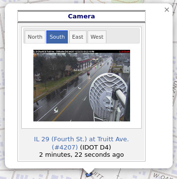
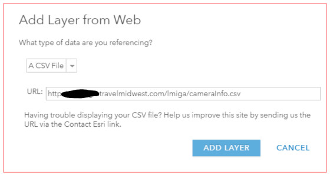
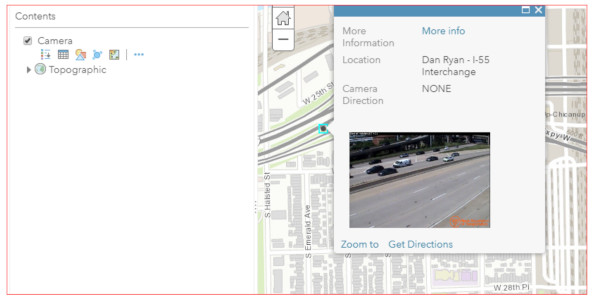

# cameraInfo.csv

## About

The Gateway provides camera snapshot images throughout its coverage area in the form of camera icons on its maps and images in its camera report.

The publicly available `cameraInfo.csv` web service provides [metadata](https://en.wikipedia.org/wiki/Metadata) for the cameras in the Gateway/TravelMidwest.com coverage area with locations and image URLs:

```
https://travelmidwest.com/lmiga/cameraInfo.csv
```

Output is in [comma-separated values (CSV)](https://en.wikipedia.org/wiki/Comma-separated_values) ASCII format suitable for use in spreadsheets (e.g. Microsoft Excel, LibreOffice Calc) and a variety of other applications.

The full output currently includes more than 4,000 camera views:

```csv
ImgPath,CameraLocation,CameraDirection,y,x,SnapShot,WarningAge,TooOld,AgeInMinutes,VideoUrl
https://travelmidwest.com/showCamera?id=IL-IDOTD1-IK14F,"I-290/I-88 Split HD",NONE,41.873,-87.9052,"https://cctv.travelmidwest.com/snapshots/IL-IDOTD1_1_Cook_EB_I-290_4187300_-8790520_1_NONE.jpg",true,true,135160,
https://travelmidwest.com/showCamera?id=IL-DUPAGECOUNTY-1&direction=E,"County Farm / Main Ent",E,41.86603,-88.14337,"https://cctv.travelmidwest.com/snapshots/IL-DUPAGECOUNTY_1_DuPage_SB_County-Farm_4186603_-8814337_1_E.jpg",false,false,1,
https://travelmidwest.com/showCamera?id=IL-DUPAGECOUNTY-1&direction=N,"County Farm / Main Ent",N,41.86603,-88.14337,"https://cctv.travelmidwest.com/snapshots/IL-DUPAGECOUNTY_1_DuPage_SB_County-Farm_4186603_-8814337_1_N.jpg",false,false,1,
https://travelmidwest.com/showCamera?id=IL-DUPAGECOUNTY-1&direction=S,"County Farm / Main Ent",S,41.86603,-88.14337,"https://cctv.travelmidwest.com/snapshots/IL-DUPAGECOUNTY_1_DuPage_SB_County-Farm_4186603_-8814337_1_S.jpg",false,false,1,
https://travelmidwest.com/showCamera?id=IL-DUPAGECOUNTY-1&direction=W,"County Farm / Main Ent",W,41.86603,-88.14337,"https://cctv.travelmidwest.com/snapshots/IL-DUPAGECOUNTY_1_DuPage_SB_County-Farm_4186603_-8814337_1_W.jpg",false,false,1,
https://travelmidwest.com/showCamera?id=IL-IDOTD4-camera_199&direction=E,"I-74 at Glen Oak DMS (#4199)",E,40.699712,-89.59306,"https://cctv.travelmidwest.com/snapshots/IL-IDOTD4_4_Peoria_SEB_I-74_4069971_-8959306_1_E.jpg",false,false,3,
https://travelmidwest.com/showCamera?id=IL-IDOTD4-camera_199&direction=W,"I-74 at Glen Oak DMS (#4199)",W,40.699712,-89.59306,"https://cctv.travelmidwest.com/snapshots/IL-IDOTD4_4_Peoria_SEB_I-74_4069971_-8959306_1_W.jpg",false,false,3,
```

> [!IMPORTANT]
> **The IDs of IDOT's downstate cameras are changing.** `IL-IDOTD4-camera_199` above becomes
> `IL-IDOTD4-4199` — the camera number IDOT already publishes in the location description.
> Anything that matches cameras between downloads by ID will need to re-read them. See
> [Camera identifiers](gateway-api/show-camera.md#camera-identifiers) for the details; the
> change lands with the release that introduces IDOT's per-district image layout.

The first line is a header row providing field/column labels for the remaining rows:

| Column | Value |
| --- | --- |
| ImgPath | **Warning:**<br>The **ImgPath** column is still included for legacy and compatibility reasons but its public use has been deprecated and no longer supported after December 13, 2024. Please use the URLs provided in the **SnapShot** column instead.<br>Deployments before 2026 wrote these URLs with a malformed scheme (`https//` rather than `https://`), which no browser will follow — another reason not to use this column.<br>Links to a snapshot display with the option to select from different camera views if available:<br> |
| CameraLocation | Text description of where the camera is located. |
| CameraDirection | This is the direction a multi-directional camera was facing when it took its snapshot picture. Uni-directional cameras will always have "NONE" in this field. The valid values for this field are N, NE, NW, S, SE, SW, E, W, and NONE.<br>The following diagram depicts a uni-directional camera that faces only east. It is represented in `cameraInfo.csv` as one row of data with the camera's latitude, longitude, and the URL of the one image file it provides.<br><br>Multi-directional cameras pan, tilt, and zoom as part of automated programs so that they can see more than one direction of traffic. These cameras pan, tilt, and zoom to face one direction, snap a picture, move to the next direction, snap a picture, etc. These cameras have one latitude and longitude coordinate but provide multiple images.<br>The following diagram depicts a multi-directional camera that faces east and west as part of its automated routine. When it faces east it creates the `image_east.jpg` file and when it faces west it creates the `image_west.jpg` file.<br><br>A camera that faces a diagonal produces a row per diagonal in the same way. The four diagonals appear for IDOT's downstate cameras from 2026; earlier downloads carried only the cardinal four, and a few of these cameras publish nothing but diagonals. |
| y | Latitude in decimal degrees using the WGS84 datum. |
| x | Longitude in decimal degrees using the WGS84 datum. |
| SnapShot | Public download URL for a camera's image file suitable for custom applications. Additional details are available in our [XML and Camera Image Download Manual](user-guides-and-manuals/xml-and-camera-image-download-manual.md#camera-images). |
| WarningAge | "true" if no image has been received from the camera for 15 minutes, otherwise "false". |
| TooOld | "true" if no image has been received from the camera for 30 minutes, otherwise "false". |
| AgeInMinutes | This is the number of minutes that have elapsed between the time the `cameraInfo.csv` file was downloaded and when the camera last sent an image to the Gateway/TravelMidwest.com. |
| VideoUrl | Public HLS stream URL for cameras that have live video and whose feed is currently allowed. Empty for every other camera, which is most of them. |

## ArcGIS Online Integration

ArcGIS Online provides an "Add Layer from Web" function that can be used along with `cameraInfo.csv` to provide a camera layer for use on web sites.

It creates a point feature using the coordinates. The pop-up can be edited to use the ‘Snapshot’ attribute to show the image~:



Questions and/or comments can be addressed to: [webmaster@travelmidwest.com](mailto:webmaster@travelmidwest.com?subject=cameraInfo.csv)
