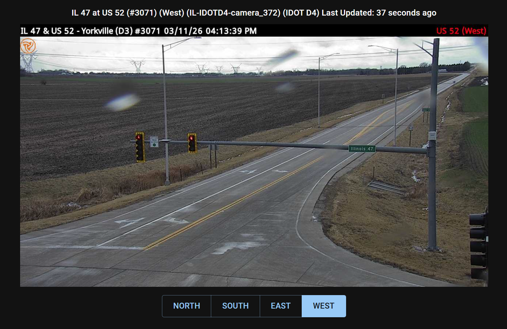

# Show Camera

## About

> [!NOTE]
> The showCamera.json endpoint is used to obtain information for the cameras present in the [cameraInfo.csv](../camera-info-csv.md) file.

The Show Camera JSON endpoint provides metadata for a single camera, including its location description, source agency, and available directions with image URLs and ages. It is used by the ShowCamera page which replaces the old showCamera.jsp popup.



## Camera identifiers

An external ID is `[state]-[source]-[agency id]`. The `[agency id]` part is whatever the
operating agency calls the camera, so its shape varies by source and it is opaque — parse
nothing out of it.

> [!IMPORTANT]
> **IDOT's downstate camera IDs are changing.** They were named after the directory the
> old roster file pointed at, as in `IL-IDOTD4-camera_305`. IDOT has moved each camera to
> uploading its own images under its own camera number, so the ID becomes that number:
> `IL-IDOTD4-3005`. The number is the one already shown in the location description —
> `I-39 at I-80 Interchange (#3005)`.
>
> Cameras are matched by ID in `cameraInfo.csv`, `cameras.json`, `cameraMap.json` and
> `cameraReport.json` alike, so anything holding stored IDs for these cameras will need to
> re-read them. The change lands with the release that introduces the per-district image
> layout; production still serves the `camera_N` form until then.
>
> `IL-IDOTD4` covers **all** of IDOT's downstate cameras, districts 2 through 9 — it is a
> source key, not a description. `IL-IDOTD4-3005` is a District 3 camera.

## Request

```console
https://travelmidwest.com/lmiga/showCamera.json?id=cameraExternalId
```

Parameters:

- id (required)
  - The external ID of the camera (e.g., `IL-IDOTD4-3005`, `IL-ISTHA-OYVF2%2FCdGpuYwBNqc%3D`)
  - Note: the ID must be URL-encoded if it contains special characters

## Response

```json
{
    "id": "IL-IDOTD4-3005",
    "locationDescription": "I-39 at I-80 Interchange (#3005)",
    "sourceName": "IDOT D4",
    "remote": true,
    "videoUrl": null,
    "directions": [
        {
            "code": "N",
            "displayName": "North",
            "remoteUrl": "https://cctv.travelmidwest.com/snapshots/IL-IDOTD4_3_LaSalle_NWB_I-39_4136695_-8905979_1_N.jpg",
            "ageMs": 572162
        },
        {
            "code": "S",
            "displayName": "South",
            "remoteUrl": "https://cctv.travelmidwest.com/snapshots/IL-IDOTD4_3_LaSalle_NWB_I-39_4136695_-8905979_1_S.jpg",
            "ageMs": 93303
        },
        {
            "code": "E",
            "displayName": "East",
            "remoteUrl": "https://cctv.travelmidwest.com/snapshots/IL-IDOTD4_3_LaSalle_NWB_I-39_4136695_-8905979_1_E.jpg",
            "ageMs": 61044
        },
        {
            "code": "W",
            "displayName": "West",
            "remoteUrl": "https://cctv.travelmidwest.com/snapshots/IL-IDOTD4_3_LaSalle_NWB_I-39_4136695_-8905979_1_W.jpg",
            "ageMs": 330187
        }
    ]
}
```

Data fields:

- id — the external ID of the camera, matching the `id` parameter in the request
- locationDescription — a text description of where the camera is located (e.g., "I-74 at Maher Rd. (Exit 75)")
- sourceName — the name of the source agency that operates the camera (e.g., "IDOT D4", "Illinois Tollway", "IDOT D1")
- remote — `true` if the camera images are served from an external URL (e.g., cctv.travelmidwest.com), `false` if served via the `/snapshot` endpoint
- videoUrl — the public HLS stream URL when the camera has live video and its feed is currently allowed; `null` otherwise
- directions — an array of available camera directions. Single-direction cameras (BasicCamera, IdotCamera) will have one entry with code `NONE`.

  The order is fixed and is **not** alphabetical: `N`, `NE`, `NW`, `S`, `SE`, `SW`, `E`, `W`.
  A camera facing all four cardinal directions is therefore returned as N, S, E, W. The
  first entry is the one to show by default.
  - code — the direction code: `N`, `S`, `E`, `W`, `NE`, `NW`, `SE`, `SW`, or `NONE`
  - displayName — the human-readable direction name: "North", "South", "East", "West", "Northeast", "Northwest", "Southeast", "Southwest", or "None"
  - remoteUrl — the direct URL to the camera image if the camera is remote; `null` if the camera is not remote (use the `/snapshot` endpoint instead)
  - ageMs — the age of the most recent image in milliseconds; `-1` if the age is unknown

## Image URLs

To display the camera image, use one of the following approaches depending on the `remote` flag:

- **Remote cameras** (`remote` = `true`): Use the `remoteUrl` field from the direction entry directly as an ``.
- **Non-remote cameras** (`remote` = `false`): Use the `/snapshot` endpoint:

```console
https://travelmidwest.com/lmiga/snapshot?id=cameraExternalId&direction=directionCode
```

The `direction` parameter is required for multi-direction cameras and should be omitted for single-direction cameras (code = `NONE`).

### Thumbnails and reference images

The `/camera` endpoint serves the smaller thumbnail image, and the IDOT reference image
where one exists. It returns the image bytes directly, so it can be used as an
``.

```console
https://travelmidwest.com/lmiga/camera?type=thumbnail&id=cameraExternalId&direction=directionCode
```

- **type** (required) — `thumbnail` for the camera thumbnail, or `reference` for the
  IDOT reference image showing the camera's normal view
- **id** (required) — the camera external ID
- **direction** (required for multi-direction cameras) — the direction code, omitted for
  single-direction cameras

Responses are cached for one minute and carry an ETag, so a conditional request returns
304 while the image is unchanged.

## Error Responses

- **404 Not Found** — returned if no camera exists with the given `id`
- **400 Bad Request** — returned if the `id` parameter is missing

## ShowCamera Page

The ShowCamera page is a standalone React page that uses this endpoint. It can be opened directly or embedded as a popup:

```console
https://travelmidwest.com/showCamera?id=IL-IDOTD4-4219&direction=E
```

Parameters:

- id (required) — the camera external ID
- direction (optional) — the initial direction to display; defaults to the first available direction

The page has no header or navigation menu, making it suitable for use as a popup window or iframe embed. The image and age refresh automatically every 30 seconds.
