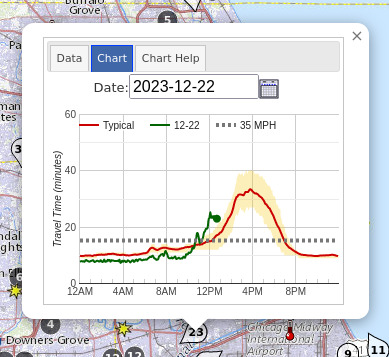

# Travel Time Statistics Graph

## About

The travel time statistics graph data provides the information needed to generate a travel time graph as seen by clicking on a travel time icon:



## Request

```console
https://travelmidwest.com/lmiga/travelTimeGraph.json?externalId=id&queryDate=yyyy-MM-dd
```

`queryDate` is optional, and if not provided, the current day is used. The `queryDate` fields are:

- externalId (required)
  - This is the identifier for the travel time in question
  - Note: a list of travel times and identifiers is available via [travelmidwest.com/lmiga/travelTime.json?path=GATEWAY.IL&debug](https://travelmidwest.com/lmiga/travelTime.json?path=GATEWAY.IL&debug)
- queryDate (optional)
  - yyyy — four digit year such as 2011
  - MM — two digit month such as "07" for July
  - dd — two digit day of month

## Response

```json
{
    "externalId": "IL-TESTTSC-222",
    "queryDate": "2019-10-28",
    "statisticsByTod": [{
            "count": 725,
            "average": 1544.689655172414,
            "stddev": 303.3442858584976,
            "tenthPercentile": 1380.0,
            "twentiethPercentile": 1440.0,
            "eightiethPercentile": 1560.0,
            "ninetiethPercentile": 1620.0,
            "minimum": 1320.0,
            "maximum": 7680.0,
            "median": 1500.0
        }, {
            "count": 713,
            "average": 1546.3674614305753,
            "stddev": 285.92716259659795,
            "tenthPercentile": 1380.0,
            "twentiethPercentile": 1440.0,
            "eightiethPercentile": 1560.0,
            "ninetiethPercentile": 1620.0,
            "minimum": 1320.0,
            "maximum": 7140.0,
            "median": 1500.0
        }, {
.
.
.
    "todayByTod": [1440, 1380, 1380, 1440, 1380, 1440, 1440, 1500, 1440, 1440, 1440, 1440, 1380, 1380, 1440, 1440, 1440, 1440, 1560, 1440, 1560, 1620, 1620, 1620, 1680, 1500, 1500, 1620, 1560, 1560, 1560, 1680, 1740, 1620, 1560, 1500, 1500, 1500, 1620, 1620, 1500, 1560, 1620, 1620, 1560, 1560, 1560, 1560, 1560, 1560, 1500, 1500, 1500, 1500, 1500, 1440, 1500, 1500, 1500, 1560, 1560, 1560, 1560, 1560, 1560, 1620, 1560, 1560, 1620, 1680, 1620, 1680, 1680, 1740, 1740, 1800, 1920, 1980, 2280, 2220, 2280, 2400, 2280, 2160, 2160, 2160, 2100, 2160, 2280, 2160, 2160, 2100, 2100, 2160, 2160, 2580, 3120, 3480, 3600, 4440, 4440, 4740, 4680, 4920, 4740, 4740, 4560, 3960, 3780, 3060, null, null, null, null, null, null, null, null, null, null, null, null, null, null, null, null, null, null, null, null, null, null, null, null, null, null, null, null, null, null, null, null, null, null, null, null, null, null, null, null, null, null, null, null, null, null, null, null, null, null, null, null, null, null, null, null, null, null, null, null, null, null, null, null, null, null, null, null, null, null, null, null, null, null, null, null, null, null, null, null, null, null, null, null, null, null, null, null, null, null, null, null, null, null, null, null, null, null, null, null, null, null, null, null, null, null, null, null, null, null, null, null, null, null, null, null, null, null, null, null, null, null, null, null, null, null, null, null, null, null, null, null, null, null, null, null, null, null, null, null, null, null, null, null, null, null, null, null, null, null, null, null, null, null, null, null, null, null, null, null, null, null, null, null, null, null, null, null, null, null, null, null, null, null, null, null, null, null]
}
```

Data fields:

- externalId — this is the GTIS identifier that uniquely identifies the travel time
- queryDate — the date that was queried
- statisticsByTod — an array containing the statistics for the given 5-minute interval indexed from 0 to 287 where 0 is midnight, 1 is 12:05 AM, 2 is 12:10 AM, etc.
  - count — the number of days that were averaged together
  - average — the average value of travel times from this tome of day across all dates that were archived, in seconds
  - tenthPercentile — the 10% highest travel time (i.e., 10% of travel times at below this value)
  - twentiethPercentile — the 20% highest travel time
  - eightiethPercentile — the 80% highest travel time
  - ninetiethPercentile — the 90% highest travel time
  - minimum — the lowest travel time ever
  - maximum — the maximum travel time
  - median — the 50% highest travel time, in seconds
- todayByTod — the travel times for today (or queryDate if provided in query). Note that the values for future times will be "null" in the array to indicate they are unknown at present.
