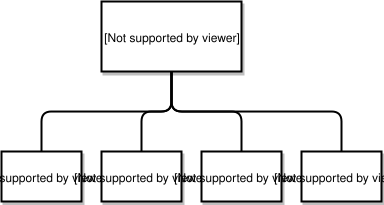
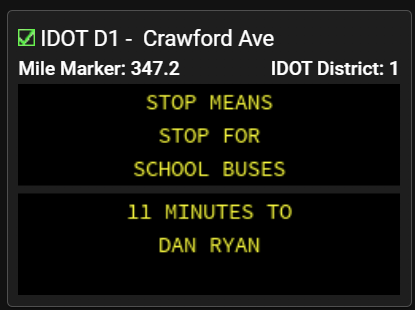

# Device Station Reports

The XSD specifications for Device Station Reports define Vehicle Detector Station (VDS) reports, Weather Sensor Station (WSS) reports, Dynamic Message Sign DMS) reports, and Highway Advisory Radio (HAR) reports. By calling them reports, we are indicating that they are services that can be obtained from the XML input and output.

## Field Device Type and Status

Device Station Reports share a common structure FieldDevice. A FieldDevice contains its status as an operational or non-operational device, a unique string device ID, its type among the devices, and a unique ID for the agency that owns the device. (See the full IDL in the Appendix for an explanation of how names are constructed.) Its location is a point location, as set out in the previous section.

```xml
<xs:simpleType name="com.gcmtravel.DeviceType">
  <xs:restriction base="xs:string">
    <xs:enumeration value="VDS_DEVICETYPE"/>
    <xs:enumeration value="DMS_DEVICETYPE"/>
    <xs:enumeration value="HAR_DEVICETYPE"/>
    <xs:enumeration value="WSS_DEVICETYPE"/>
    <xs:enumeration value="OTHER_DEVICETYPE"/>
  </xs:restriction>
</xs:simpleType>
<xs:simpleType name="com.gcmtravel.FieldDeviceStatus">
  <xs:restriction base="xs:string">
    <xs:enumeration value="UNKNOWN_FIELD_DEVICE_STATUS"/>
    <xs:enumeration value="NONE_FIELD_DEVICE_STATUS"/>
    <xs:enumeration value="OPERATIONAL"/>
    <xs:enumeration value="OPERATIONAL_BUT_DEGRADED"/>
    <xs:enumeration value="NON_OPERATIONAL"/>
    <xs:enumeration value="COMMUNICATOINS_FAILURE"/>
    <xs:enumeration value="DOWN_FOR_MAINTENANCE"/>
  </xs:restriction>
</xs:simpleType>
```

```xml
<xs:element name="fieldDeviceID" type="xs:string"/>
<xs:element name="owningAgencyID" type="xs:string"/>
```

Two additional enumeration fields indicate the status of data validation and fusion efforts. Data can often be corrected if it was meant to be a parsable valid entry, but was mis-entered or mis-transmitted. This recovery can be by manual or automatic procedures. It can be validated when found to be within the expected bounds and infeasible if not. It can also be pre-validation, before any validation procedure has been applied.

In a similar fashion, the Gateway attempts to resolve locations by finding their precise meaning and translating them into a common basic type, namely the geometry point profile. Correction of transmission mal-formation is done, if possible. Resolution proceeds by manual or automatic procedure. Success is indicated by a location resolved status, while lack of success is indicated by a unresolvable status. The "Location not validated" status is a pre-resolution status.

```xml
<xs:simpleType name="com.gcmtravel.LocationResolutionStatus">
  <xs:restriction base="xs:string">
    <xs:enumeration value="LOCATION_NO_LOCATION"/>
    <xs:enumeration value="LOCATION_NON_SRA"/>
    <xs:enumeration value="LOCATION_PARTIALLY_NON_SRA"/>
    <xs:enumeration value="LOCATION_NOT_VALIDATED"/>
    <xs:enumeration value="LOCATION_UNRESOLVABLE_AUTO"/>
    <xs:enumeration value="LOCATION_UNRESOLVABLE_MANUAL"/>
    <xs:enumeration value="LOCATION_PARTIALLY_RESOLVED_MANUAL"/>
    <xs:enumeration value="LOCATION_PARTIALLY_RESOLVED_AUTO"/>
    <xs:enumeration value="LOCATION_CORRECTED_AND_RESOLVED_AUTO"/>
    <xs:enumeration value="LOCATION_CORRECTED_AND_RESOLVED_MANUAL"/>
    <xs:enumeration value="LOCATION_RESOLVED_MANUAL"/>
    <xs:enumeration value="LOCATION_RESOLVED_AUTO"/>
  </xs:restriction>
</xs:simpleType>
```

The FieldDataValidationStatus and the Location Resolution Status fields are required because data validation and location resolution are in some cases carried out by data source DSI machines and the Gateway needs an indication of status to know what remains to be done. The time of the entering or updating of a Field Device is kept in the struc. The last time that the location of the device was referenced is also kept in the structure. This is useful because devices are relatively stationary and locations can be used a check on whether the same device has been given more than one FieldDevice identifier. Contrariwise, when the same device id shows up at a different location, the old device is removed from the system because it has been moved.

The XSD for a FieldDevice is as follows:

```xml
<xs:complexType name="com.gcmtravel.FieldDevice">
  <xs:sequence>
    <xs:element name="deviceStatus" type="com.gcmtravel.FieldDeviceStatus"/>
    <xs:element name="fieldDeviceID" type="xs:string"/>
    <xs:element name="type" type="com.gcmtravel.DeviceType"/>
    <xs:element name="location">
      <xs:complexType>
        <xs:sequence minOccurs="0" maxOccurs="unbounded">
          <xs:element name="locationElement" type="com.gcmtravel.PointLocationProfile"/>
        </xs:sequence>
      </xs:complexType>
    </xs:element>
    <xs:element name="owningAgencyID" type="xs:string"/>
    <xs:element name="locStatus" type="com.gcmtravel.LocationResolutionStatus"/>
    <xs:element name="dataStatus" type="com.gcmtravel.FieldDataValidationStatus"/>
    <xs:element name="lastUpdateTime" type="xs:long"/>
    <xs:element name="locationTimeStamp" type="xs:long"/>
  </xs:sequence>
</xs:complexType>
```

## Inheritance

Figure 4-1 shows that the device reports inherit a common abstract structure from the field device specification. The links represent the super-class relationship. All of the device reports add specificity to the general structure represented by the field device. The field device needs only a point roadway location. Devices are stationary and their location need not be determined dynamically. The Gateway checks for new locations for the same device and takes the later location as the true one, adding that location to the database. Locations for portable field devices are dealt with accurately in this way.

Because XSD does not support the notion of inheritance, a "parent" reference is used to represent the fields of the super-type. The "parent" contains all the fields on the super-class.

**Figure 4-1 Device Class Inheritance**



## Vehicle Detector Station (VDS)

### Vehicle Detector Station Report Output Format

Like all reports in the Gateway IDL, the device reports have a list of the data structure which is the subject of the report, a report ID, and a time stamp. (See the full GatewayDevice IDL in the Appendix for the way the reportID is constructed.) The Vehicle Detector Station (VDS) report given below illustrates this common structure of reports:

```xml
<xs:element name="com.gcmtravel.VDSReport">
  <xs:complexType>
    <xs:sequence minOccurs="0" maxOccurs="unbounded">
      <xs:element name="com.gcmtravel.VDSReportElement" type="com.gcmtravel.VDS"/>
    </xs:sequence>
  </xs:complexType>
</xs:element>
```

### Vehicle Detector Station Report Input Format

A slightly different format is needed for publishing VDS reports to the GTIS as follows:

```xml
<xs:element name="com.gcmtravel.VDSReport">
  <xs:complexType>
    <xs:sequence>
      <xs:element name="reportID" type="xs:string"/>
      <xs:element name="timeStamp" type="xs:long"/>
      <xs:element name="listOfVDS">
        <xs:complexType>
          <xs:sequence minOccurs="0" maxOccurs="unbounded">
            <xs:element name="listOfVDSElement" type="com.gcmtravel.VDS"/>
          </xs:sequence>
        </xs:complexType>
      </xs:element>
    </xs:sequence>
  </xs:complexType>
</xs:element>
```

### Vehicle Detector Station Types

A vehicle detector station can be any of the devices for sensing the presence and characteristics of vehicles at a specific roadway location. We begin to build up the VDS data structure by defining the various types for VDS devices:

```xml
<xs:simpleType name="com.gcmtravel.VDSType">
  <xs:restriction base="xs:string">
    <xs:enumeration value="UNKNOWN_VDS_TYPE"/>
    <xs:enumeration value="LOOP"/>
    <xs:enumeration value="VISION"/>
    <xs:enumeration value="ACOUSTIC"/>
    <xs:enumeration value="INFRARED"/>
    <xs:enumeration value="RADAR"/>
    <xs:enumeration value="MICROWAVE"/>
    <xs:enumeration value="OTHER_VDS_TYPE"/>
  </xs:restriction>
</xs:simpleType>
```

### VDS

The VDS data structure is made up of a field device data structure, a VDS type and a number of quantities that come from vehicle detector station reports:

```xml
<xs:complexType name="com.gcmtravel.VDS">
  <xs:sequence>
    <xs:element name="parent" type="com.gcmtravel.FieldDevice"/>
    <xs:element name="type" type="com.gcmtravel.VDSType"/>
    <xs:element name="volume" type="xs:short"/>     <!-- veh/ln/hr -->
    <xs:element name="occupancy" type="xs:double"/> <!-- percentage 0 to 100 -->
    <xs:element name="speed" type="xs:double"/>     <!-- meters per second -->
    <xs:element name="isSpeedTrap" type="xs:boolean"/>
    <xs:element name="detectorizationRatio" type="xs:double"/>
  </xs:sequence>
</xs:complexType>
```

While most data elements are obvious, the following needs to be noted:

- Occupancy is the percent of time that a given point on the roadway is occupied. It is less if the speeds are high.
- The detectorizationRatio is the ratio of the number of lanes monitored to the total number of lanes.

## Weather Sensor Stations (WSS)

### Weather Sensor Station Report Output Format

A Weather Sensor Station (WSS) report is a comprehensive report of the various roadway relevant weather measurements, including the precipitation, atmosphere and surface conditions. As usual, the report consists of a list of weather sensor station data structures, an ID string, and a time stamp.

```xml
<xs:element name="com.gcmtravel.WSSReport">
  <xs:complexType>
    <xs:sequence minOccurs="0" maxOccurs="unbounded">
      <xs:element name="com.gcmtravel.WSSReportElement" type="com.gcmtravel.WSS"/>
    </xs:sequence>
  </xs:complexType>
</xs:element>
```

### Weather Sensor Station Report Input Format

The input format for WSS is similar to its output format but with the addition of a time stamp and report identifier:

```xml
<xs:element name="com.gcmtravel.WSSReport">
  <xs:complexType>
    <xs:sequence>
      <xs:element name="reportID" type="xs:string"/>
      <xs:element name="timeStamp" type="xs:long"/>
      <xs:element name="listOfWSS">
        <xs:complexType>
          <xs:sequence minOccurs="0" maxOccurs="unbounded">
            <xs:element name="listOfWSSElement" type="com.gcmtravel.WSS"/>
          </xs:sequence>
        </xs:complexType>
      </xs:element>
    </xs:sequence>
  </xs:complexType>
</xs:element>
```

### Precipitation Type and Intensity

```xml
<xs:simpleType name="com.gcmtravel.PrecipType>
  <xs:restriction base="xs:string">
    <xs:enumeration value="PRECIP_UNKNOWN"/>
    <xs:enumeration value="PRECIP_NONE"/>
    <xs:enumeration value="PRECIP_RAIN"/>
    <xs:enumeration value="PRECIP_SNOW"/>
    <xs:enumeration value="PRECIP_MIXED_RAIN_AND_SNOW"/>
    <xs:enumeration value="PRECIP_OTHER"/>
  </xs:restriction>
</xs:simpleType>
<xs:simpleType name="com.gcmtravel.PrecipIntensity>
  <xs:restriction base="xs:string">
    <xs:enumeration value="UNKNOWN_PRECIP_INTENSITY"/>
    <xs:enumeration value="LIGHT_PRECIP"/>
    <xs:enumeration value="MODERATE_PRECIP"/>
    <xs:enumeration value="HEAVY_PRECIP"/>
  </xs:restriction>
</xs:simpleType>
```

### Surface Conditions

```xml
<xs:simpleType name="com.gcmtravel.SurfaceCondition>
  <xs:restriction base="xs:string">
    <xs:enumeration value="SURFACE_CONDITION_UNKNOWN"/>
    <xs:enumeration value="SURFACE_DRY"/>
    <xs:enumeration value="SURFACE_WET"/>
    <xs:enumeration value="SURFACE_CHEMICAL_WET"/>
    <xs:enumeration value="SURFACE_SNOW_ICE"/>
    <xs:enumeration value="SURFACE_ABSORPTION"/>
    <xs:enumeration value="SURFACE_ABSORPTION2"/>
    <xs:enumeration value="SURFACE_DEW"/>
    <xs:enumeration value="SURFACE_FROST"/>
    <xs:enumeration value="SURFACE_ABSORPTION_AT_DEW_POINT"/>
    <xs:enumeration value="SURFACE_FROST2"/>
    <xs:enumeration value="SURFACE_ICE_ALERT"/>
  </xs:restriction>
</xs:simpleType>
```

### Precipitation Sensor Readings

```xml
<xs:complexType name="com.gcmtravel.PrecipReadings">
  <xs:sequence>
    <xs:element name="precipSensorStatus" type="com.gcmtravel.FieldDeviceStatus"/>
    <xs:element name="type" type="com.gcmtravel.PrecipType"/>
    <xs:element name="intensity" type="com.gcmtravel.PrecipIntensity"/>
    <xs:element name="precipRate" type="xs:double"/>  <!-- mm/hr -->
    <xs:element name="precipAccumulation" type="xs:double"/> <!-- since midnight in mm -->
  </xs:sequence>
</xs:complexType>
```

### Atmospheric Sensor Readings

```xml
<xs:complexType name="com.gcmtravel.PrecipReadings">
  <xs:sequence>
    <xs:element name="precipSensorStatus" type="com.gcmtravel.FieldDeviceStatus"/>
    <xs:element name="type" type="com.gcmtravel.PrecipType"/>
    <xs:element name="intensity" type="com.gcmtravel.PrecipIntensity"/>
    <xs:element name="precipRate" type="xs:double"/>  <!-- mm/hr -->
    <xs:element name="precipAccumulation" type="xs:double"/> <!-- since midnight in mm -->
  </xs:sequence>
</xs:complexType>
```

### Surface Sensor Readings

```xml
<xs:complexType name="com.gcmtravel.SurfaceReadings">
  <xs:sequence>
    <xs:element name="surfaceSensorStatus" type="com.gcmtravel.FieldDeviceStatus"/>
    <xs:element name="pavementSurfaceTemp" type="xs:double"/>  <!-- Celsius -->
    <xs:element name="pavementSubsurfaceTemp" type="xs:double"/>  <!-- Celsius -->
    <xs:element name="pavementSurfaceChemicalFactor" type="xs:short"/>
    <xs:element name="pavementCondition" type="com.gcmtravel.SurfaceCondition"/>
    <xs:element name="pavementSurfaceIceIndex" type="xs:short"/>
    <xs:element name="pavementSurfacePrecipInitialFreezingTemp" type="xs:double"/>
    <xs:element name="pavementSurfacePrecipDepth" type="xs:double"/>
  </xs:sequence>
</xs:complexType>
```

### WSS

We show the XSD of the weather sensor station data structure as follows:

```xml
<xs:complexType name="com.gcmtravel.SurfaceReadings">
  <xs:sequence>
    <xs:element name="surfaceSensorStatus" type="com.gcmtravel.FieldDeviceStatus"/>
    <xs:element name="pavementSurfaceTemp" type="xs:double"/>  <!-- Celsius -->
    <xs:element name="pavementSubsurfaceTemp" type="xs:double"/>  <!-- Celsius -->
    <xs:element name="pavementSurfaceChemicalFactor" type="xs:short"/>
    <xs:element name="pavementCondition" type="com.gcmtravel.SurfaceCondition"/>
    <xs:element name="pavementSurfaceIceIndex" type="xs:short"/>
    <xs:element name="pavementSurfacePrecipInitialFreezingTemp" type="xs:double"/>
    <xs:element name="pavementSurfacePrecipDepth" type="xs:double"/>
  </xs:sequence>
</xs:complexType>
```

## Dynamic Message Signs (DMS)

A dynamic message sign (DMS) is a sign that can change the messages presented to the viewer, such as Variable Message Sign (VMS), Changeable Message Signs (CMS), or Blank Out Sign (BOS).

### Dynamic Message Sign Report Output Format

Here is the format for the DMS XML output:

```xml
<xs:element name="com.gcmtravel.DMSReport">
  <xs:complexType>
    <xs:sequence minOccurs="0" maxOccurs="unbounded">
      <xs:element name="com.gcmtravel.DMSReportElement" type="com.gcmtravel.DMS"/>
    </xs:sequence>
  </xs:complexType>
</xs:element>
```

### Dynamic Message Sign Report Input Format

The Dynamic Message Sign Report consists of a dynamic message sign list, a report ID, and a time stamp:

```xml
<xs:element name="com.gcmtravel.DMSReport">
  <xs:complexType>
    <xs:sequence>
      <xs:element name="reportID" type="xs:string"/>
      <xs:element name="timeStamp" type="xs:long"/>
      <xs:element name="listOfDMS">
        <xs:complexType>
          <xs:sequence minOccurs="0" maxOccurs="unbounded">
            <xs:element name="listOfDMSElement" type="com.gcmtravel.DMS"/>
          </xs:sequence>
        </xs:complexType>
      </xs:element>
    </xs:sequence>
  </xs:complexType>
</xs:element>
```

### DMS Message Set

A message set is a logical unit of information, which may consist of multiple lines. In practice, no more than three lines may be presented to the viewer since a driver can take in a limited amount of content while passing by. A maximum of twelve lines is allowed for in the XSD. More than one message can be showing at a time on the same DMS on a rotational basis. For example, a sign may have the following message sets:



Depending on the DMS device and the length of the message, one message set can be displayed in a single frame, or more than one message set can be displayed in a single frame. For example, the above two message sets can be displayed in a single frame on a three-line DMS device, or displayed in rotation in two frames on a 2-line DMS device.

```xml
<xs:complexType name="com.gcmtravel.DMSMessageSet">
  <xs:sequence>
    <xs:element name="dmsLines">
      <xs:complexType>
        <xs:sequence minOccurs="0" maxOccurs="unbounded">
          <xs:element name="dmsLinesElement" type="xs:string"/>
        </xs:sequence>
      </xs:complexType>
    </xs:element>
    <xs:element name="messageExpiration" type="xs:long"/>
    <xs:element name="lastUpdateTime" type="xs:long"/>
  </xs:sequence>
</xs:complexType>
```

### DMS

The dynamic message sign definition consists of the "parent" FieldDevice and the DMSMessageSet.

```xml
<xs:complexType name="com.gcmtravel.DMS">
  <xs:sequence>
    <xs:element name="parent" type="com.gcmtravel.FieldDevice"/>
    <xs:element name="messageSets">
      <xs:complexType>
        <xs:sequence minOccurs="0" maxOccurs="unbounded">
          <xs:element name="messageSetsElement" type="com.gcmtravel.DMSMessageSet"/>
        </xs:sequence>
      </xs:complexType>
    </xs:element>
  </xs:sequence>
</xs:complexType>
```

## Highway Advisory Radio (HAR)

### Highway Advisory Radio Reports Output Format

```xml
<xs:element name="com.gcmtravel.HARReport">
  <xs:complexType>
    <xs:sequence minOccurs="0" maxOccurs="unbounded">
      <xs:element name="com.gcmtravel.HARReportElement" type="com.gcmtravel.HAR"/>
    </xs:sequence>
  </xs:complexType>
</xs:element>
```

### Highway Advisory Radio Reports Input Format

Similarly to the Dynamic Message Sign Report data structure above, a Highway Advisory Radio (HAR) report consists of a list of highway advisory radio data structures, a report ID, and a time stamp.

```xml
<xs:element name="com.gcmtravel.HARReport">
  <xs:complexType>
    <xs:sequence>
      <xs:element name="reportID" type="xs:string"/>
      <xs:element name="timeStamp" type="xs:long"/>
      <xs:element name="listOfHAR">
        <xs:complexType>
          <xs:sequence minOccurs="0" maxOccurs="unbounded">
            <xs:element name="listOfHARElement" type="com.gcmtravel.HAR"/>
          </xs:sequence>
        </xs:complexType>
      </xs:element>
    </xs:sequence>
  </xs:complexType>
</xs:element>
```

### HAR Message Set

```xml
<xs:complexType name="com.gcmtravel.HARMessageSet">
  <xs:sequence>
    <xs:element name="harLines">
      <xs:complexType>
        <xs:sequence minOccurs="0" maxOccurs="unbounded">
          <xs:element name="harLinesElement" type="xs:string"/>
        </xs:sequence>
      </xs:complexType>
    </xs:element>
    <xs:element name="messageExpiration" type="xs:long"/>
    <xs:element name="lastUpdateTime" type="xs:long"/>
  </xs:sequence>
</xs:complexType>
```

### HAR

The highway advisory radio data structure is as follows:

```xml
<xs:complexType name="com.gcmtravel.HAR">
  <xs:sequence>
    <xs:element name="parent" type="com.gcmtravel.FieldDevice"/>
    <xs:element name="messageSets">
      <xs:complexType>
        <xs:sequence minOccurs="0" maxOccurs="unbounded">
          <xs:element name="messageSetsElement" type="com.gcmtravel.HARMessageSet"/>
        </xs:sequence>
      </xs:complexType>
    </xs:element>
  </xs:sequence>
</xs:complexType>
```
