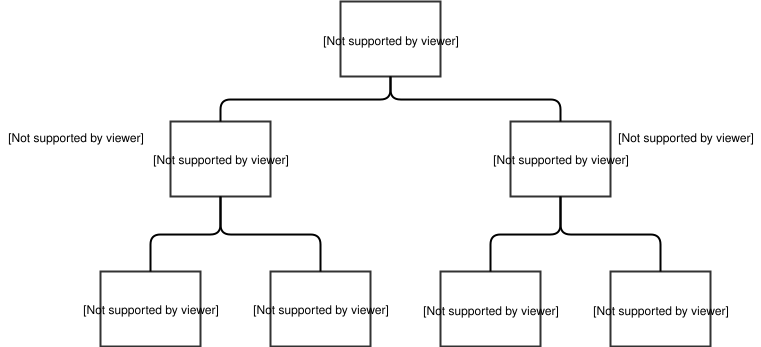
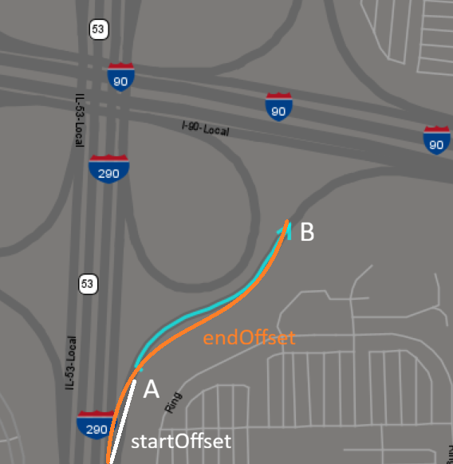
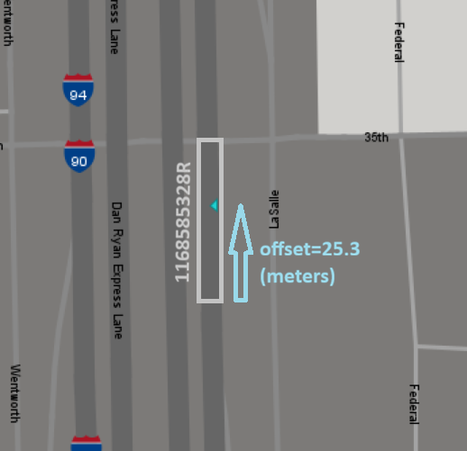

# Locations

The Gateway specification for roadway locations provides accurate, unambiguous, yet concise and flexible ways to specify locations in a roadway network. While based on the Location Reference Message Specification (LRMS), the Gateway location specification has been specifically developed for applications that adopt Center-to-Center (C2C) communication protocols. The Gateway specification significantly enhances the LRMS specification by inclusion of a comprehensive method for referencing cross-sectional components of the roadway.

A full roadway location specification includes a specification of a position along a roadway and a cross-sectional position in the road or off to the right or left of the roadway. The position along the roadway is called the linear location and may be a point location or a length of roadway called a section or link. The cross-sectional position is used for specifying an effect or intensity of effect of an event that is localized to a particular lane or part of the roadway.
Roadway locations are linear when the "point location" on a road is all that needs to be specified, or a "section" of road involving two points is required to say where a measurement or event took place. (A section is always a continuous, connected piece of road.) When in addition, a location within or off the side of a road is needed, the location is specified with a "lane" description. A roadway location can be linear, or can be a linear location together with a lane location. Below we have a diagram of these relationships:

**Figure 3-1 Roadway Location Classes**



In the following sections we show how each of these profiles are is used to give a precise linear, point and section locations. In a particular situation they may be considered alternatives, or a particular location may be specified redundantly with two or more profiles. A reporting data source may choose to use one or the other because it is simpler or more natural in the situation where he is. The text profile may be a last resort for an observer when none of the other profiles apply when data is being reported. When a textual report has been supplied, a redundant specification of the location by another observer may make the location precise for the Gateway. If no other profile is provided, a manual intervention by operator may be required to make the location precise. The text profile is often the preferred way to distribute information from the Gateway in a humanly understandable form.

## Common Elements of Linear Roadway Locations

Roadway Locations have certain common elements that we explain now before going on to explain the variations for each profile. Location reports typically include the roadway name, the roadway direction, and the roadway type. The roadway name is a contains two strings and two uses of the StreetNameAffixenumeration. The strings are the name by which the roadway roadway is known, and a type, called the streetType, such as "Road", "Drive" or "Lane". The prefix StreetNameAffix is for specifications like "N.", "S.", "SE". In some areas this information is after the StreetName, while in others it is before. The XSD is as follows:

```xml
<xs:simpleType name="com.gcmtravel.StreetNameAffix">
  <xs:restriction base="xs:string">
    <xs:enumeration value="NONE"/>
    <xs:enumeration value="N"/>
    <xs:enumeration value="NE"/>
    <xs:enumeration value="E"/>
    <xs:enumeration value="SE"/>
    <xs:enumeration value="S"/>
    <xs:enumeration value="SW"/>
    <xs:enumeration value="W"/>
    <xs:enumeration value="NW"/>
  </xs:restriction>
</xs:simpleType>
<xs:complexType name="com.gcmtravel.RoadwayName">
  <xs:sequence>
    <xs:element name="name" type="xs:string"/>
    <xs:element name="prefix" type="com.gcmtravel.StreetNameAffix"/>
    <xs:element name="suffix" type="com.gcmtravel.StreetNameAffix"/>
    <xs:element name="streetType" type="xs:string"/>
  </xs:sequence>
</xs:complexType>
```

The possibilities for roadway type are given in the following enumeration:

```xml
<xs:simpleType name="com.gcmtravel.RoadwayType">
  <xs:restriction base="xs:string">
    <xs:enumeration value="UNKNOWN_ROADWAY_TYPE"/>
    <xs:enumeration value="FREEWAY"/>
    <xs:enumeration value="FREEWAY_EXPRESS"/>
    <xs:enumeration value="FREEWAY_HOV"/>
    <xs:enumeration value="FREEWAY_REVERSIBLE"/>
    <xs:enumeration value="ARTERIAL"/>
    <xs:enumeration value="LOCAL_ROAD"/>
    <xs:enumeration value="RAMP"/>
    <xs:enumeration value="OTHER_ROADWAY_TYPE"/>
  </xs:restriction>
</xs:simpleType>
```

Information provider personnel should be trained in the recognition and proper encoding for these possibilities.

The roadway direction is required in profiles specifying a location with an offset, or when specifying lanes in a bi-directional roadway. The RoadwayDirectionType, defined in the XSD below, allows the user to specify the eight general direction types. A local direction is determined by the actual direction of the roadway in a localized area in which the event being described is located. In most situations, local and global directions will agree with each other. When they differ, a global direction should be used. The global direction may vary with the type of a roadway: For an Interstate highway, the direction to be selected is the national designation; and, for a state highway, the direction is the corridor- wide direction.

```xml
<xs:simpleType name="com.gcmtravel.RoadwayDirectionType">
  <xs:restriction base="xs:string">
    <xs:enumeration value="UNKNOWN_DIRECTION_TYPE"/>
    <xs:enumeration value="EAST_BOUND"/>
    <xs:enumeration value="WEST_BOUND"/>
    <xs:enumeration value="SOUTH_BOUND"/>
    <xs:enumeration value="NORTH_BOUND"/>
    <xs:enumeration value="SOUTH_EAST_BOUND"/>
    <xs:enumeration value="SOUTH_WEST_BOUND"/>
    <xs:enumeration value="NORTH_EAST_BOUND"/>
    <xs:enumeration value="NORTH_WEST_BOUND"/>
  </xs:restriction>
</xs:simpleType>
```

Designation of a direction gives a referential basis for other encoding done by the observer. In profiles that use an offset to show the distance from a landmark, or cross street, or along a ramp, the offset is positive in the direction given and negative in the opposite direction.

An additional piece of information that is typically required is the Federal Information Processing Standard (FIPS) code of the roadway. The FIPS refers to the area or jurisdiction the location is in. The XSD for the FIPS is the following:

```xml
<xs:complexType name="com.gcmtravel.FIPSCode">
  <xs:sequence>
    <xs:element name="stateCode" type="xs:int"/>
    <xs:element name="countyCode" type="xs:int"/>
    <xs:element name="cityCode" type="xs:int"/>
  </xs:sequence>
</xs:complexType>
```

With this as background we discuss the use of each profile for locating a roadway point or section.

## LatLong Profile

In the specification of a linear point location by LatLong (latitude and longitude) you record the values of latitude and longitude in microdegrees along with the format of the measurement. The linear section location by LatLong requires the specification of two points with one designated the start and the other the end according to the direction of the roadway:

```xml
<xs:simpleType name="com.gcmtravel.HDatumType">
  <xs:restriction base="xs:string">
    <xs:enumeration value="NAD27"/>
    <xs:enumeration value="NAD83"/>
    <xs:enumeration value="WGS84"/>
    <xs:enumeration value="WGS84_PLUS_EGM96"/>
    <xs:enumeration value="OTHER_HDATUM_TYPE"/>
  </xs:restriction>
</xs:simpleType>
<xs:complexType name="com.gcmtravel.LatLong">
  <xs:sequence>
    <xs:element name="latitude" type="xs:int"/>  <!-- in microdegrees -->
    <xs:element name="longitude" type="xs:int"/> <!-- in microdegrees -->
    <xs:element name="hDatum" type="com.gcmtravel.HDatumType"/>
  </xs:sequence>
</xs:complexType>
<xs:complexType name="com.gcmtravel.LatLongPoint">
  <xs:sequence>
    <xs:element name="roadName" type="com.gcmtravel.RoadwayName"/>
    <xs:element name="direction" type="com.gcmtravel.RoadwayDirectionType"/>
    <xs:element name="type" type="com.gcmtravel.RoadwayType"/>
    <xs:element name="coord" type="com.gcmtravel.LatLong"/>
  </xs:sequence>
</xs:complexType>
<xs:complexType name="com.gcmtravel.LatLongSection">
  <xs:sequence>
    <xs:element name="roadName" type="com.gcmtravel.RoadwayName"/>
    <xs:element name="direction" type="com.gcmtravel.RoadwayDirectionType"/>
    <xs:element name="type" type="com.gcmtravel.RoadwayType"/>
    <xs:element name="startLatLong" type="com.gcmtravel.LatLong"/>
    <xs:element name="endLatLong" type="com.gcmtravel.LatLong"/>
  </xs:sequence>
</xs:complexType>
```

The LatLong profile is illustrated by the following diagram:

**Figure 3-2 LatLong Profile**


## Landmark Profile

A linear point location can be specified by reference to a landmark. A landmark has a name represented by a string. The location by landmark uses an offset measured in the direction of the roadway. An example of location by landmark would be "300 feet North from the water tower on Interstate 88". A linear section location based on landmarks has a pair of landmark names and offsets for points designated start and end. It allows for the possibility of two FIPS codes designated start and end.

```xml
<xs:complexType name="com.gcmtravel.LandmarkPoint">
  <xs:sequence>
    <xs:element name="roadName" type="com.gcmtravel.RoadwayName"/>
    <xs:element name="direction" type="com.gcmtravel.RoadwayDirectionType"/>
    <xs:element name="type" type="com.gcmtravel.RoadwayType"/>
    <xs:element name="fips" type="com.gcmtravel.FIPSCode"/>
    <xs:element name="landmarkName" type="xs:string"/>
    <xs:element name="offset" type="xs:double"/>  <!-- in meters, positive in direction stated above -->
  </xs:sequence>
</xs:complexType>
<xs:complexType name="com.gcmtravel.LandmarkSection">
  <xs:sequence>
    <xs:element name="roadName" type="com.gcmtravel.RoadwayName"/>
    <xs:element name="direction" type="com.gcmtravel.RoadwayDirectionType"/>
    <xs:element name="type" type="com.gcmtravel.RoadwayType"/>
    <xs:element name="startFipsCode" type="com.gcmtravel.FIPSCode"/>
    <xs:element name="endFipsCode" type="com.gcmtravel.FIPSCode"/>
    <xs:element name="startLandmarkName" type="xs:string"/>
    <xs:element name="startOffset" type="xs:double"/> <!-- in meters, positive in direction stated above -->
    <xs:element name="endLandmarkName" type="xs:string"/>
    <xs:element name="endOffset" type="xs:double"/>  <!-- in meters -->
  </xs:sequence>
</xs:complexType>
```

The following is a diagram of the Landmark profile:

**Figure 3-3 Landmark Profile**


The landmark profile is not applicable unless both sender and receiver know the landmark.

## Address Profile

The Address profile uses house numbers or addresses for locating points on the roadway. The address numbering system is a well-known part of our locating system. The Gateway specification for an address is a string representing an unsigned integer. No offset is used with this method of location. The specification for a section based on house numbers has a start house number and FIPS code and an end house number and FIPS code. The XSD specifications are:

```xml
<xs:complexType name="com.gcmtravel.AddressPoint">
  <xs:sequence>
    <xs:element name="roadName" type="com.gcmtravel.RoadwayName"/>
    <xs:element name="direction" type="com.gcmtravel.RoadwayDirectionType"/>
    <xs:element name="type" type="com.gcmtravel.RoadwayType"/>
    <xs:element name="fips" type="com.gcmtravel.FIPSCode"/>
    <xs:element name="addressNumber" type="xs:string"/>
  </xs:sequence>
</xs:complexType>
<xs:complexType name="com.gcmtravel.AddressSection">
  <xs:sequence>
    <xs:element name="roadName" type="com.gcmtravel.RoadwayName"/>
    <xs:element name="direction" type="com.gcmtravel.RoadwayDirectionType"/>
    <xs:element name="type" type="com.gcmtravel.RoadwayType"/>
    <xs:element name="startFipsCode" type="com.gcmtravel.FIPSCode"/>
    <xs:element name="endFipsCode" type="com.gcmtravel.FIPSCode"/>
    <xs:element name="startAddressNumber" type="xs:string"/>
    <xs:element name="endAddressNumber" type="xs:string"/>
  </xs:sequence>
</xs:complexType>
```

The diagram for the address profile is as follows:

**Figure 3-4 Address Profile**


## Mile Marker Profile

A mile marker may be used to locate a point on a road. Mile markers often have decimal parts making for more precise locations. The XSD for this profile requires a FIPSCode to be specified. (See the discussion above of common elements in locations.)  To specify a section based on mile markers we use start and end mile markers and FIPS's.

```xml
<xs:complexType name="com.gcmtravel.MilePointPoint">
  <xs:sequence>
    <xs:element name="roadName" type="com.gcmtravel.RoadwayName"/>
    <xs:element name="direction" type="com.gcmtravel.RoadwayDirectionType"/>
    <xs:element name="type" type="com.gcmtravel.RoadwayType"/>
    <xs:element name="fips" type="com.gcmtravel.FIPSCode"/>
    <xs:element name="milePoint" type="xs:double"/>  <!-- in meters, positive in direction of increasing MM values -->
  </xs:sequence>
</xs:complexType>
<xs:complexType name="com.gcmtravel.MilePointSection">
  <xs:sequence>
    <xs:element name="roadName" type="com.gcmtravel.RoadwayName"/>
    <xs:element name="direction" type="com.gcmtravel.RoadwayDirectionType"/>
    <xs:element name="type" type="com.gcmtravel.RoadwayType"/>
    <xs:element name="startFipsCode" type="com.gcmtravel.FIPSCode"/>
    <xs:element name="endFipsCode" type="com.gcmtravel.FIPSCode"/>
    <xs:element name="startMilePoint" type="xs:double"/>  <!-- in meters, positive in direction of increasing MM values -->
    <xs:element name="endMilePoint" type="xs:double"/>    <!-- in meters -->
  </xs:sequence>
</xs:complexType>
```

The diagram for mile marker profile is:

**Figure 3-5 Mile Marker Profile**


## Cross Street Profile

A roadway location may be specified by reference to a cross street. The RoadwayName struct, RoadwayDirectionType, and RoadwayType of the cross street is used in this profile. An offset is measured from the cross street in the direction of the roadway to the point location. A FIPSCode is also required. The specification for a section based on the cross street profiles has a "from" cross street name, direction, and type and a "to" cross street name, direction, and type. Each has an offset and a FIPSCode. The XSD is:

```xml
<xs:complexType name="com.gcmtravel.CrossStreetPoint">
  <xs:sequence>
    <xs:element name="roadName" type="com.gcmtravel.RoadwayName"/>
    <xs:element name="direction" type="com.gcmtravel.RoadwayDirectionType"/>
    <xs:element name="type" type="com.gcmtravel.RoadwayType"/>
    <xs:element name="fips" type="com.gcmtravel.FIPSCode"/>
    <xs:element name="crossStreetName" type="com.gcmtravel.RoadwayName"/>
    <xs:element name="crossStreetType" type="com.gcmtravel.RoadwayType"/>
    <xs:element name="crossStreetDirection" type="com.gcmtravel.RoadwayDirectionType"/>
    <xs:element name="offset" type="xs:double"/> <!-- in meters, positive in direction stated above -->
  </xs:sequence>
</xs:complexType>
<xs:complexType name="com.gcmtravel.CrossStreetSection">
  <xs:sequence>
    <xs:element name="roadName" type="com.gcmtravel.RoadwayName"/>
    <xs:element name="direction" type="com.gcmtravel.RoadwayDirectionType"/>
    <xs:element name="type" type="com.gcmtravel.RoadwayType"/>
    <xs:element name="startFipsCode" type="com.gcmtravel.FIPSCode"/>
    <xs:element name="endFipsCode" type="com.gcmtravel.FIPSCode"/>
    <xs:element name="fromCrossStreetName" type="com.gcmtravel.RoadwayName"/>
    <xs:element name="fromCrossStreetType" type="com.gcmtravel.RoadwayType"/>
    <xs:element name="fromStreetDirection" type="com.gcmtravel.RoadwayDirectionType"/>
    <xs:element name="startOffset" type="xs:double"/>   <!-- in meters, positive in direction stated above -->
    <xs:element name="toCrossStreetName" type="com.gcmtravel.RoadwayName"/>
    <xs:element name="toCrossStreetType" type="com.gcmtravel.RoadwayType"/>
    <xs:element name="toStreetDirection" type="com.gcmtravel.RoadwayDirectionType"/>
    <xs:element name="endOffset" type="xs:double"/>     <!-- in meters, positive in direction stated above -->
  </xs:sequence>
</xs:complexType>
```

The diagram for this profile is:

**Figure 3-6 Cross Street Profile**


## Ramp Profile

The XSD specification for a linear ramp point location provides for a "from" roadway name, type, direction, and FIPS and for a "to" roadway name, type, direction and FIPS. An offset is provided for the distance along the ramp from the "from" roadway. The specification for a section by ramp points has a start offset and an end offset to define two ramp points. Start and end are defined by the direction of traffic along the ramp.

```xml
<xs:complexType name="com.gcmtravel.RampPoint">
  <xs:sequence>
    <xs:element name="fromRoadName" type="com.gcmtravel.RoadwayName"/>
    <xs:element name="fromDirection" type="com.gcmtravel.RoadwayDirectionType"/>
    <xs:element name="fromRoadwayType" type="com.gcmtravel.RoadwayType"/>
    <xs:element name="fips" type="com.gcmtravel.FIPSCode"/>
    <xs:element name="toRoadName" type="com.gcmtravel.RoadwayName"/>
    <xs:element name="toDirection" type="com.gcmtravel.RoadwayDirectionType"/>
    <xs:element name="toRoadwayType" type="com.gcmtravel.RoadwayType"/>
    <xs:element name="offset" type="xs:double"/>  <!-- in meters along ramp's direction -->
  </xs:sequence>
</xs:complexType>
<xs:complexType name="com.gcmtravel.RampSection">
  <xs:sequence>
    <xs:element name="fromRoadName" type="com.gcmtravel.RoadwayName"/>
    <xs:element name="fromDirection" type="com.gcmtravel.RoadwayDirectionType"/>
    <xs:element name="fromRoadwayType" type="com.gcmtravel.RoadwayType"/>
    <xs:element name="fips" type="com.gcmtravel.FIPSCode"/>
    <xs:element name="toRoadName" type="com.gcmtravel.RoadwayName"/>
    <xs:element name="toDirection" type="com.gcmtravel.RoadwayDirectionType"/>
    <xs:element name="toRoadwayType" type="com.gcmtravel.RoadwayType"/>
    <xs:element name="startOffset" type="xs:double"/>  <!-- in meters along ramp's direction -->
    <xs:element name="endOffset" type="xs:double"/>    <!-- in meters along ramp's direction -->
  </xs:sequence>
</xs:complexType>
```

The diagram of this profile shows a ramp from "fromRoadwayName" to "toRoadwayName". The start point is A and the end point is B.

**Figure 3-7 Ramp Profile**


The same profile over a real interchange, the ramp from I-290 North to I-90 East: `startOffset` is drawn in white, `endOffset` in orange, and the ramp section itself in light blue with an arrow giving its direction. A is the start point and B the end point, as above.

**Figure 3-8 Ramp Profile Example**



## LatLongRamp Profile

The LatLongRamp profile is the ramp profile with a coordinate attached. It carries the same "from" and "to" roadway designation and the same offset along the ramp as the [Ramp Profile](#ramp-profile), and adds the latitude and longitude of the point itself, so a receiver can place the point without resolving the ramp in its own map database.

This profile belongs to **version 2.0 XML** — see [Versions](versions.md). The Gateway writes `latLongRampPointLoc` and `latLongRampSectionLoc` into version 2.0 documents only. Reading is not quite symmetrical: a document read as version 1.0 passes over `latLongRampSectionLoc`, while `latLongRampPointLoc` is accepted whichever version the document declares.

```xml
<xs:complexType name="com.gcmtravel.LatLongRampPoint">
  <xs:sequence>
    <xs:element name="fromRoadName" type="com.gcmtravel.RoadwayName"/>
    <xs:element name="fromDirection" type="com.gcmtravel.RoadwayDirectionType"/>
    <xs:element name="fromRoadwayType" type="com.gcmtravel.RoadwayType"/>
    <xs:element name="fips" type="com.gcmtravel.FIPSCode"/>
    <xs:element name="toRoadName" type="com.gcmtravel.RoadwayName"/>
    <xs:element name="toDirection" type="com.gcmtravel.RoadwayDirectionType"/>
    <xs:element name="toRoadwayType" type="com.gcmtravel.RoadwayType"/>
    <xs:element name="offset" type="xs:double"/>  <!-- in meters along ramp's direction -->
    <xs:element name="coord" type="com.gcmtravel.LatLong"/>
  </xs:sequence>
</xs:complexType>
<xs:complexType name="com.gcmtravel.LatLongRampSection">
  <xs:sequence>
    <xs:element name="fromRoadName" type="com.gcmtravel.RoadwayName"/>
    <xs:element name="fromDirection" type="com.gcmtravel.RoadwayDirectionType"/>
    <xs:element name="fromRoadwayType" type="com.gcmtravel.RoadwayType"/>
    <xs:element name="fromFips" type="com.gcmtravel.FIPSCode"/>
    <xs:element name="startOffset" type="xs:double"/>  <!-- in meters along ramp's direction -->
    <xs:element name="toRoadName" type="com.gcmtravel.RoadwayName"/>
    <xs:element name="toDirection" type="com.gcmtravel.RoadwayDirectionType"/>
    <xs:element name="toRoadwayType" type="com.gcmtravel.RoadwayType"/>
    <xs:element name="toFips" type="com.gcmtravel.FIPSCode"/>
    <xs:element name="endOffset" type="xs:float"/>  <!-- in meters along ramp's direction -->
    <xs:element name="startLatLong" type="com.gcmtravel.LatLong"/>
    <xs:element name="endLatLong" type="com.gcmtravel.LatLong"/>
  </xs:sequence>
</xs:complexType>
```

A point is reported as `latLongRampPointLoc`. A location that carries one normally carries the plain [ramp point](#ramp-profile) for the same spot as well, each in its own element:

```xml
<latLongRampPointLoc>
  <fromRoadName>
    <name>I-94</name>
    <prefix>NONE</prefix>
    <suffix>NONE</suffix>
    <streetType/>
  </fromRoadName>
  <fromDirection>WEST_BOUND</fromDirection>
  <fromRoadwayType>UNKNOWN_ROADWAY_TYPE</fromRoadwayType>
  <fips>
    <stateCode>17</stateCode>
    <countyCode>31</countyCode>
    <cityCode>14000</cityCode>
  </fips>
  <toRoadName>
    <name>I-294</name>
    <prefix>NONE</prefix>
    <suffix>NONE</suffix>
    <streetType/>
  </toRoadName>
  <toDirection>SOUTH_BOUND</toDirection>
  <toRoadwayType>UNKNOWN_ROADWAY_TYPE</toRoadwayType>
  <offset>250.75</offset>
  <coord>
    <latitude>4190000</latitude>
    <longitude>-8770000</longitude>
    <hDatum>NAD83</hDatum>
  </coord>
</latLongRampPointLoc>
```

The coordinate is in microdegrees, as everywhere else in these profiles, and the FIPS code carries state, county and city only — no zip code. The offset is in meters along the ramp, measured from the "from" roadway.

A section is reported as `latLongRampSectionLoc`, and its fields are not simply a start point followed by an end point: the "from" name, direction, type and FIPS come from the **start** point and the "to" set from the **end** point, both ends being understood to lie on the same ramp. The Gateway emits the section only when both ends carry a LatLongRamp point and the two agree on the ramp's name; where they disagree it omits the section rather than report it wrong.

```xml
<latLongRampSectionLoc>
  <fromRoadName>
    <name>I-65</name>
    <prefix>NONE</prefix>
    <suffix>NONE</suffix>
    <streetType/>
  </fromRoadName>
  <fromDirection>SOUTH_BOUND</fromDirection>
  <fromRoadwayType>UNKNOWN_ROADWAY_TYPE</fromRoadwayType>
  <fromFips>
    <stateCode>18</stateCode>
    <countyCode>89</countyCode>
    <cityCode>32818</cityCode>
  </fromFips>
  <startOffset>100.0</startOffset>
  <toRoadName>
    <name>I-94</name>
    <prefix>NONE</prefix>
    <suffix>NONE</suffix>
    <streetType/>
  </toRoadName>
  <toDirection>EAST_BOUND</toDirection>
  <toRoadwayType>UNKNOWN_ROADWAY_TYPE</toRoadwayType>
  <toFips>
    <stateCode>18</stateCode>
    <countyCode>89</countyCode>
    <cityCode>32818</cityCode>
  </toFips>
  <endOffset>3.4028235E38</endOffset>
  <startLatLong>
    <latitude>4158030</latitude>
    <longitude>-8718330</longitude>
    <hDatum>NAD83</hDatum>
  </startLatLong>
  <endLatLong>
    <latitude>4158100</latitude>
    <longitude>-8718200</longitude>
    <hDatum>NAD83</hDatum>
  </endLatLong>
</latLongRampSectionLoc>
```

> [!IMPORTANT]
> `endOffset` is a float where `startOffset` is a double, and the value `3.4028235E38` — the largest float there is — is a flag meaning "to the end of the ramp", not a distance of 340 undecillion meters. The example above is a section that runs from 100 meters along the I-65 South to I-94 East ramp to wherever that ramp ends.

Both elements are among the choices listed under [Point Location Profile](#point-location-profile) and [Section Location Profile](#section-location-profile) below.

## Between Cross Streets Profile

The XSD specification for the cross streets profile provides for locating a point on a roadway as being a percentage (float) of the way between two cross streets specified by name, direction, and type. The direction of the roadway causes one cross street to be designated the "from' street and the other the "to" street. A start percent and an end percent are used to define a start point and an end point for the section.

The GTIS does not proesently support the between cross streets profile.

## Geometry Profile

A geometry point is defined by reference to a "segment ID". This allows us to find the segment in a map database. The problem is that map databases are not standard and are often proprietary. Segment IDs are subject to change in different database versions and use of them imposes the a burden of synchronizing versions and updates. If everyone is on the same page, after obtaining a segment ID, locating a point using this method is done with an offset from the Ref node of the segment measured in the direction of the roadway specified in the SegmentDirectionType enumeration direction value. Segments have two nodes, the Ref Node and the Non-Ref Node The linear section location by geometry point uses two segment ID's and two offsets. There must be a continuous sequence of segments between the start segment whose ID is given and the end segment. The XSD for this profile is:

```xml
<xs:simpleType name="com.gcmtravel.SegmentDirectionType">
  <xs:restriction base="xs:string">
    <xs:enumeration value="REF_TO_NONREF"/>
    <xs:enumeration value="NONREF_TO_REF"/>
  </xs:restriction>
</xs:simpleType>
<xs:complexType name="com.gcmtravel.GeometryPoint">
  <xs:sequence>
    <xs:element name="direction" type="com.gcmtravel.SegmentDirectionType"/>
    <xs:element name="segmentID" type="xs:long"/>
    <xs:element name="offset" type="xs:double"/> <!-- meters from directional start -->
  </xs:sequence>
</xs:complexType>
<xs:complexType name="com.gcmtravel.LatLong">
  <xs:sequence>
    <xs:element name="latitude" type="xs:int"/>
    <xs:element name="longitude" type="xs:int"/>
    <xs:element name="hDatum" type="com.gcmtravel.HDatumType"/>
  </xs:sequence>
</xs:complexType>
<xs:complexType name="com.gcmtravel.GeometrySection">
  <xs:sequence>
    <xs:element name="startSegmentDirection" type="com.gcmtravel.SegmentDirectionType"/>
    <xs:element name="segmentIDs">
      <xs:complexType>
        <xs:sequence minOccurs="0" maxOccurs="unbounded">
          <xs:element name="segmentIDsElement" type="xs:long"/>
        </xs:sequence>
      </xs:complexType>
    </xs:element>
    <xs:element name="startOffset" type="xs:double"/>  <!-- meters from directional start -->
    <xs:element name="endOffset" type="xs:double"/>  <!-- meters from directional start -->
  </xs:sequence>
</xs:complexType>
```

**Figure 3-9 Geometry Profile**


The offsets for the geometry profiles are specified in meters from the start of the segment. For segments that represent two directions of a road, the start may be either the "Ref" or "Non-Ref" depending on the SegmentDirectionType. Most interstates are digitized as uni-directional (one segment per direction) so their offset will always be from the "Ref" node of the segment.

A geometry point over a real segment, `1168585328R` in the Dan Ryan express lanes near 35th Street. The white outline is the segment, and the arrow is the offset measured from its Ref node in the `REF_TO_NONREF` direction — the direction the `R` suffix on the segment label stands for.

**Figure 3-10 Geometry Profile Example**



The figure rounds the offset; the point it draws is reported as:

```xml
<geometryPointLoc>
  <direction>REF_TO_NONREF</direction>
  <segmentID>1168585328</segmentID>
  <offset>25.341177804894947</offset>
</geometryPointLoc>
```

## Text Profile

Sometimes all you have is a description of the point or section, and the Gateway includes this possibility in its profile for designation by text. If none of the other profiles are possible, reports are submitted using a text description. The text profile may also be used to return a humanly accessible message to Gateway users. The XSD is as follows:

```xml
<xs:element name="textProfile" type="xs:string"/>
```

> [!WARNING]
> The GTIS will not be able to place data with only a text profile in its maps and reports.

## Generic Section

In addition to the profiles that specify linear section locations by two points of the same profile, the Gateway XSD provides for specifying a section by using two points of arbitrary profile. In order to specify that a point specification may be of any of the above profiles, the following is specified:

```xml
<xs:complexType name="com.gcmtravel.GenericSection">
  <xs:sequence>
    <xs:element name="startPoint" type="com.gcmtravel.PointLocationProfile"/>
    <xs:element name="endPoint" type="com.gcmtravel.PointLocationProfile"/>
  </xs:sequence>
</xs:complexType>
```

## Point Location Profile

The PointLocationProfile type groups all point location types together as follows:

```xml
<xs:complexType name="com.gcmtravel.PointLocationProfile">
  <xs:choice>
    <xs:element name="latLongPointLoc" type="com.gcmtravel.LatLongPoint"/>
    <xs:element name="landmarkPointLoc" type="com.gcmtravel.LandmarkPoint"/>
    <xs:element name="addressPointLoc" type="com.gcmtravel.AddressPoint"/>
    <xs:element name="milePointPointLoc" type="com.gcmtravel.MilePointPoint"/>
    <xs:element name="crossStreetPointLoc" type="com.gcmtravel.CrossStreetPoint"/>
    <xs:element name="rampPointLoc" type="com.gcmtravel.RampPoint"/>
    <xs:element name="betweenStreetPointLoc" type="com.gcmtravel.BetweenStreetPoint"/>
    <xs:element name="geometryPointLoc" type="com.gcmtravel.GeometryPoint"/>
    <xs:element name="latLongRampPointLoc" type="com.gcmtravel.LatLongRampPoint"/>  <!-- version 2.0 only -->
  </xs:choice>
</xs:complexType>
```

## Section Location Profile

The SectionLocationProfile type groups all section location types together as follows:

```xml
<xs:complexType name="com.gcmtravel.SectionLocationProfile">
  <xs:choice>
    <xs:element name="latLongSectionLoc" type="com.gcmtravel.LatLongSection"/>
    <xs:element name="landmarkSectionLoc" type="com.gcmtravel.LandmarkSection"/>
    <xs:element name="addressSectionLoc" type="com.gcmtravel.AddressSection"/>
    <xs:element name="milePointSectionLoc" type="com.gcmtravel.MilePointSection"/>
    <xs:element name="crossStreetSectionLoc" type="com.gcmtravel.CrossStreetSection"/>
    <xs:element name="rampSectionLoc" type="com.gcmtravel.RampSection"/>
    <xs:element name="betweenStreetSectionLoc" type="com.gcmtravel.BetweenStreetSection"/>
    <xs:element name="geometrySectionLoc" type="com.gcmtravel.GeometrySection"/>
    <xs:element name="genericSectionLoc" type="com.gcmtravel.GenericSection"/>
    <xs:element name="latLongRampSectionLoc" type="com.gcmtravel.LatLongRampSection"/>  <!-- version 2.0 only -->
  </xs:choice>
</xs:complexType>
```

## Linear Location

A data structure that is one of the above point specifications together with a tag for saying which, i.e. the choice of the point specifications, is called a Point Location Profile (see above). In a similar manner the choice of section specifications with a tag is the Section Location Profile. The choice of point and section specifications is the Linear Location Profile:

```xml
<xs:complexType name="com.gcmtravel.PointSectionUnion">
  <xs:choice>
    <xs:element name="point">
      <xs:complexType>
        <xs:sequence minOccurs="0" maxOccurs="unbounded">
          <xs:element name="pointElement" type="com.gcmtravel.PointLocationProfile"/>
        </xs:sequence>
      </xs:complexType>
    </xs:element>
    <xs:element name="section">
      <xs:complexType>
        <xs:sequence minOccurs="0" maxOccurs="unbounded">
          <xs:element name="sectionElement" type="com.gcmtravel.SectionLocationProfile"/>
        </xs:sequence>
      </xs:complexType>
    </xs:element>
  </xs:choice>
</xs:complexType>
<xs:complexType name="com.gcmtravel.LinearLocation">
  <xs:sequence>
    <xs:element name="profiles" type="com.gcmtravel.PointSectionUnion"/>
    <xs:element name="textProfile" type="xs:string"/>
  </xs:sequence>
</xs:complexType>
```

The XSD defines a list of Linear Locations and a sequence of the sequences.

## Lane Descriptions or Cross-Sectional Roadway Positions

A cross-sectional position in the road or off to the right or left of the roadway can be represented with a "lane desc" XSD specification. The cross-sectional LaneDesc location is used for specifying the effect or intensity of effect (LaneImpactType) of an event that is localized to a particular lane or part of the roadway. An example would be the closing of a particular lane because of blockage by a chemical spillage. To specify a location including the lane(s) affected, a location that includes a linear location and one or more LaneDesc(s) is used.

The basic part of the LaneDesc struct is the lane number designation. Lane numbers are an index to lanes based on the perspective of a driver going in particular direction on the roadway. The number 1 designates the leftmost lane serving traffic going in the same direction as our driver. The highest lane number is the index of the rightmost lane going in the same direction. A shoulder (right or left) is considered non-indexable and had a lane number of 0. If the lane number is unknown, it is given a negative index.

A location with lane specifications will have as many lane structs as there are lanes needing to be specified. Thus, the location of a chemical spillage closing three lanes of I-240 would include three lane descs. In this regard shoulders are counted as lanes and require specification with a separate struct. An unspecified number of lanes is represented by one lane struct with an index of 99. Negative lane numbers can be used to represent counting from the right side of the road instead of the left side so that lane -1 is the rightmost followed by -2, -3, etc. The GTIS will automatically convert negative lane numbers into their positive counterpart.

Each lane includes the lane type and lane impact type. The lane type enumeration shown below includes generic lanes, express lanes, HOV lanes, reversible lanes, off-road locations and all of these at once. With each type are sub-designations for left and right shoulders, entrance and exit lanes, and right and left designations for off-road locations. The lane impact types include closed, impassable, reduced speed and lane shifted conditions, along with unknown and none. These specifications overlap with lane numbers in some respects, but together the provide fine, grandular specifics of cross-sectional conditions.

The XSD for lanes follows this comentary. The lane types are extensive and it is appropriate that training be given personnel in the accurate reporting of lane types. For example if you have multiple lanes in each direction and a median strip, you can have shoulders on both sides of the lanes going in a single direction.

Using the roadway direction on Figure 3-10, the left shoulder position is in the center of the road as indicated. Likewise, an off the road left position is in the median left of the left shoulder. In the same way the position of the right shoulder is off the edge of the road as indicated. The location off the road to the right is beyond the right shoulder. Taking the roadway direction into account again, the left-most or innermost lane is lane 1, the second left most is lane 2, etc. By use of the lane direction types, the same distinctions can be made going the opposite direction, reversing the orientations of right and left. Left is, once again, to the center or inner part of the road, and right is toward the edge of the road. The IDL reflecting these explanations is the following:

```xml
<xs:simpleType name="com.gcmtravel.LaneType">
  <xs:restriction base="xs:string">
    <xs:enumeration value="UNKNOWN_LANE_TYPE"/>
    <xs:enumeration value="LANE"/>
    <xs:enumeration value="LEFT_SHOULDER"/>
    <xs:enumeration value="RIGHT_SHOULDER"/>
    <xs:enumeration value="SHOULDER"/>
    <xs:enumeration value="MEDIAN"/>
    <xs:enumeration value="EXPRESS_LANE"/>
    <xs:enumeration value="EXPRESS_ENTRANCE_LANE"/>
    <xs:enumeration value="EXPRESS_EXIT_LANE"/>
    <xs:enumeration value="EXPRESS_CONNECTOR_LANE"/>
    <xs:enumeration value="LEFT_EXPRESS_SHOULDER"/>
    <xs:enumeration value="RIGHT_EXPRESS_SHOULDER"/>
    <xs:enumeration value="EXPRESS_SHOULDER"/>
    <xs:enumeration value="HOV_LANE"/>
    <xs:enumeration value="HOV_ENTRANCE_LANE"/>
    <xs:enumeration value="HOV_EXIT_LANE"/>
    <xs:enumeration value="HOV_CONNECTOR_LANE"/>
    <xs:enumeration value="LEFT_HOV_SHOULDER"/>
    <xs:enumeration value="RIGHT_HOV_SHOULDER"/>
    <xs:enumeration value="HOV_SHOULDER"/>
    <xs:enumeration value="REVERSIBLE_LANE"/>
    <xs:enumeration value="REVERSIBLE_ENTRANCE_LANE"/>
    <xs:enumeration value="REVERSIBLE_EXIT_LANE"/>
    <xs:enumeration value="REVERSIBLE_CONNECTOR_LANE"/>
    <xs:enumeration value="LEFT_REVERSIBLE_SHOULDER"/>
    <xs:enumeration value="RIGHT_REVERSIBLE_SHOULDER"/>
    <xs:enumeration value="REVERSIBLE_SHOULDER"/>
    <xs:enumeration value="OFF_ROAD_LEFT"/>
    <xs:enumeration value="OFF_ROAD_RIGHT"/>
    <xs:enumeration value="OFF_ROAD"/>
    <xs:enumeration value="UNKNOWN_NUMBER_OF_LANES"/>
    <xs:enumeration value="UNKNOWN_NUMBER_OF_LANES_AND_SHOULDERS"/>
    <xs:enumeration value="CENTER_LANE"/>
    <xs:enumeration value="UNSPECIFIED_LANE"/>
    <xs:enumeration value="ALL_LANES"/>
    <xs:enumeration value="ALL_LANES_AND_SHOULDERS"/>
  </xs:restriction>
</xs:simpleType>
<xs:simpleType name="com.gcmtravel.LaneImpactType">
  <xs:restriction base="xs:string">
    <xs:enumeration value="UNKNOWN_LANE_IMPACT"/>
    <xs:enumeration value="NONE_LANE_IMPACT"/>
    <xs:enumeration value="CLOSED"/>
    <xs:enumeration value="IMPASSABLE"/>
    <xs:enumeration value="SPEED_REDUCED"/>
    <xs:enumeration value="LANE_SHIFTED"/>
    <xs:enumeration value="OTHER_LANE_IMPACT"/>
  </xs:restriction>
</xs:simpleType>
<xs:complexType name="com.gcmtravel.LaneDesc">
  <xs:sequence>
    <xs:element name="type" type="com.gcmtravel.LaneType"/>
    <xs:element name="laneImpact" type="com.gcmtravel.LaneImpactType"/>
    <xs:element name="laneNumber" type="xs:short"/>
  </xs:sequence>
</xs:complexType>
```

The XSD for lane specifies a sequence of LaneDesc in the usual manner:

```xml
<xs:element name="lane">
  <xs:complexType>
    <xs:sequence minOccurs="0" maxOccurs="unbounded">
      <xs:element name="laneElement" type="com.gcmtravel.LaneDesc"/>
    </xs:sequence>
  </xs:complexType>
</xs:element>
```

**Figure 3-11 Lane Positions**

|  |
| --- |
| ← Right shoulder |
| ←Lane 3 |
| ←Lane 2 |
| ←Lane 1 |
| ←Left Shoulder |
| <Median> |
| Left Shoulder → |
| Lane 1 → |
| Lane 2 → |
| Lane 3 → |
| Right Shoulder → |

### Fully Specified Lane Descriptions

The system will attempt to fully specify the lanes whenever possible. The location of the event must be known and resolvable to a location with a known number of lanes. Typically lane count information is available for all interstates in the coverage area. A fully specified lane description will include a left should, one or more lanes, and a right shoulder.

**Example of Fully Specified Lanes**

```xml
<lane>
  <laneElement>
    <type>LEFT_SHOULDER</type>
    <laneImpact>CLOSED</laneImpact>
    <laneNumber>0</laneNumber>
  </laneElement>
  <laneElement>
    <type>LANE</type>
    <laneImpact>NONE_LANE_IMPACT</laneImpact>
    <laneNumber>1</laneNumber>
  </laneElement>
  <laneElement>
    <type>LANE</type>
    <laneImpact>NONE_LANE_IMPACT</laneImpact>
    <laneNumber>2</laneNumber>
  </laneElement>
  <laneElement>
    <type>LANE</type>
    <laneImpact>NONE_LANE_IMPACT</laneImpact>
    <laneNumber>3</laneNumber>
  </laneElement>
  <laneElement>
    <type>RIGHT_SHOULDER</type>
    <laneImpact>CLOSED</laneImpact>
    <laneNumber>0</laneNumber>
  </laneElement>
</lane>
```

The maximum lane number present in fully specified lane descriptions will correspond to the number of lanes at the location of the event. If the event spans a section of roadway, then the maximum number of lanes thoroughout the roadway section will be used.

### Various Lanes

Some events do not contain information about the number of lanes or how many are closed. In these cases, the lane type will be set to UNKNOWN_NUMBER_OF_LANES, the laneImpact will be CLOSED, and the laneNumber will be zero.

**Various lanes closed**

```xml
<lane>
  <laneElement>
    <type>UNKNOWN_NUMBER_OF_LANES</type>
    <laneImpact>CLOSED</laneImpact>
    <laneNumber>0</laneNumber>
  </laneElement>
</lane>
```

### Full Closures

Full closures can be represented two ways. The first is to provide all the lanes as in "Fully Specified Lane Descriptions" above and mark all the lanes as CLOSED. The second way of representing a full closure is to use type ALL_LANES_AND_SHOULDERS or ALL_LANES with a laneImpact of CLOSED.

**Full Closure using ALL_LANES_AND_SHOULDERS**

```xml
<lane>
  <laneElement>
    <type>UNKNOWN_NUMBER_OF_LANES</type>
    <laneImpact>CLOSED</laneImpact>
    <laneNumber>0</laneNumber>
  </laneElement>
</lane>
```

## Roadway Location

The full power of the location specifications is brought to bear when a linear location is combined with a lane specification. The Linear Roadway Location specification sets out the position along a roadway, and the lane gives the cross-sectional position in the road or off to the right or left of the roadway. The XSD is as follows:

```xml
<xs:complexType name="com.gcmtravel.RoadwayLocation">
  <xs:sequence>
    <xs:element name="linear" type="com.gcmtravel.LinearLocation"/>
    <xs:element name="lane">
      <xs:complexType>
        <xs:sequence minOccurs="0" maxOccurs="unbounded">
          <xs:element name="laneElement" type="com.gcmtravel.LaneDesc"/>
        </xs:sequence>
      </xs:complexType>
    </xs:element>
    <xs:element name="originalInput" type="xs:string"/>
  </xs:sequence>
</xs:complexType>
```

The original input string component of the RoadwayLocation struct is for preserving the information the data provider entered that was converted to a location specification.  A sequence of Roadway Locations is specified as well in the usual manner.

```xml
<xs:sequence minOccurs="0" maxOccurs="unbounded">
  <xs:element name="locationsElement" type="com.gcmtravel.RoadwayLocation"/>
</xs:sequence>
```

## Application of the Specifications for Locations

The location specifications are used in the definitions of reports explained in other sections of this document, and do not themselves define any reports. In our discussions of the XSD for available reports in the remaining sections of this document, we will not make any new explanations of locations.
