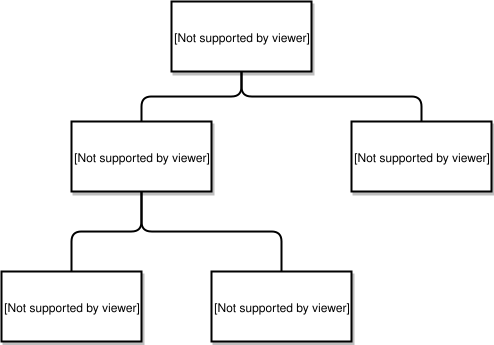

# Roadway Events

Distribution of roadway event information to the Gateway user is one primary purpose of the Gateway. Roadway events are defined as a subclass of Events, allowing for future expansion into a multi-modal traveler information service. Here we deal with two kinds of roadway events with very differing reporting requirements. An incident is an unscheduled event. In contrast we have a generic scheduled event, and two kinds of scheduled events, namely roadwork events , and special events.

The Gateway XSD defines Incident Reports, Roadwork Reports, and the Special Event Reports. A common Roadway Event data structure is the super-class of these event report data structures. Each report type adds specificity for the events it portrays. We show these relationships in the following diagram where the arrows represent the super-class relationship:

**Figure 5-1 Roadway Event Classes**



The roadway event data structure contains a unique ID which is made up of two sub-strings. The first part is a standard abbreviation of the agency that originated the report. The following are tentatively defined:

| prefix | data source name |
| --- | --- |
| IL-GAI | IDOT GAI |
| IL-TSC | TSC |
| IL-SKYWAY | Skyway |
| MN-CARS | MnDOT Cars |
| IL-CDOT | Chicago DOT |
| IL-OEMC | Chicago OEMC |
| IN-ITR | Indiana Toll Road |
| MI-MDOT | MDOT |
| IL-TESTTIMS | Illinois Tollway TIMS |
| IL-COMMCENTER | IDOT ComCenter |
| WI-MNT_XML_V001 | WisDOT Monitor |
| IL-TIMS | Illinois Tollway |
| MN-IRIS | MnDOT |
| IL-LAKECOUNTY | Lake County |
| WI-WisDOT | WisDOT |
| IN-InDOT | InDOT |
| IL-ISTHA | Illinois Tollway |
| IL-IDOTD4 | IDOT D4 |
| GLRTOC-GATEWAY | Gateway |
| GLRTOC-OTHER | Other |
| IL-IDOTD8 | IDOT D8 |
| IL-IDOTD3 | IDOT D3 |
| IL-IDOTD5 | IDOT D5 |
| IL-IDOTD6 | IDOT D6 |
| IL-IDOTD7 | IDOT D7 |
| IL-IDOTD9 | IDOT D9 |
| IL-TESTTSC | IDOT D1 |
| IL-IDOT | IDOT D1 |
| IL-IDOTI80 | IDOT D1 |
| IL-ACTS | IDOT ACTS |
| IL-IDOTD2 | IDOT D2 |
| IA-IOWADOT | IowaDOT |
| OH-ODOT | ODOT |
| OH-TURNPIKE | TURNPIKE |
| MO-MODOT | MoDOT |
| IN-CARS | InDOT Cars |
| IA-CARS | IowaDOT Cars |
| IL-KANECOUNTY | Kane County |
| MI-TFR | MDOT TFR |
| MI-LCAR | MDOT LCAR |

The second part of the roadway event ID is a string that uniquely identifies the event within the reporting agency.

The event type for the Roadway Event data structure is defined by the following enumeration:

```xml
<xs:simpleType name="com.gcmtravel.EventType">
  <xs:restriction base="xs:string">
    <xs:enumeration value="INCIDENT_EVENT_TYPE"/>
    <xs:enumeration value="ROADWORK_EVENT_TYPE"/>
    <xs:enumeration value="SPECIAL_EVENT_TYPE"/>
    <xs:enumeration value="OTHER_EVENT_TYPE"/>
  </xs:restriction>
</xs:simpleType>
```

The roadway event data structure has a severity and a confidence level:

```xml
<xs:simpleType name="com.gcmtravel.EventSeverity">
  <xs:restriction base="xs:string">
    <xs:enumeration value="UNKNOWN_EVENT_SEVERITY"/>
    <xs:enumeration value="NONE_EVENT_SEVERITY"/>
    <xs:enumeration value="MINOR_EVENT_SEVERITY"/>
    <xs:enumeration value="MEDIUM_EVENT_SEVERITY"/>
    <xs:enumeration value="MAJOR_EVENT_SEVERITY"/>
  </xs:restriction>
</xs:simpleType>
```

```xml
  <xs:restriction base="xs:string">
    <xs:enumeration value="UNKNOWN_EVENT_CONFIDENCE_LEVEL"/>
    <xs:enumeration value="LOW_EVENT_CONFIDENCE_LEVEL"/>
    <xs:enumeration value="MEDIUM_EVENT_CONFIDENCE_LEVEL"/>
    <xs:enumeration value="HIGH_EVENT_CONFIDENCE_LEVEL"/>
  </xs:restriction>
</xs:simpleType>
```

> [!WARNING]
> The GTIS will only display HIGH_EVENT_CONFIDENCE_LEVEL events on its maps and reports. However, the events are made available in the output XML reports and to the GTIS operators.

The roadway event super-class contains two strings that are used for comments and a description of the event in natural English.

The XSD allows for the most general kind of roadway location including lists of roadway locations. This is useful when an event has a number of different locations, for example when an event causes the closing of multiple sections of the roadway. See the section on locations above.

Two additonal fields indicate the status of data validation and fusion efforts. Data can be corrected when recovery is made of data that was meant to be an ascertainable valid entry, but was mis-entered or mis-transmitted. The data recovery can be by manual or automatic procedures. Data can be validated by being found to be within expected bounds, and infeasible if not. It can also be pre-validation, before any validation procedure has been applied.

In a similar fashion, the Gateway attempts to resolve locations by finding their precise meaning and translating them into a common basic type, namely the geometry point profile. Correction of transmission mal-formation is done, if possible. Resolution proceeds by manual or automatic procedure. Success is indicated by a location resolved status, while lack of success is indicated by a unresolvable status. The "Location not validated" status is a pre-resolution status indicating that resolution must still be done.

The IDL for these is as follows:

```xml
<xs:simpleType name="com.gcmtravel.LocationResolutionStatus">
  <xs:restriction base="xs:string">
    <xs:enumeration value="LOCATION_NO_LOCATION"/>
    <xs:enumeration value="LOCATION_NON_SRA"/>
    <xs:enumeration value="LOCATION_PARTIALLY_NON_SRA"/>
    <xs:enumeration value="LOCATION_NOT_VALIDATED"/>
    <xs:enumeration value="LOCATION_UNRESOLVABLE_AUTO"/>
    <xs:enumeration value="LOCATION_UNRESOLVABLE_MANUAL"/>
    <xs:enumeration value="LOCATION_PARTIALLY_RESOLVED_MANUAL"/>
    <xs:enumeration value="LOCATION_PARTIALLY_RESOLVED_AUTO"/>
    <xs:enumeration value="LOCATION_CORRECTED_AND_RESOLVED_AUTO"/>
    <xs:enumeration value="LOCATION_CORRECTED_AND_RESOLVED_MANUAL"/>
    <xs:enumeration value="LOCATION_RESOLVED_MANUAL"/>
    <xs:enumeration value="LOCATION_RESOLVED_AUTO"/>
  </xs:restriction>
</xs:simpleType>
```

```xml
<xs:simpleType name="com.gcmtravel.FieldDataValidationStatus">
  <xs:restriction base="xs:string">
    <xs:enumeration value="FIELD_DATA_NOT_VALIDATED"/>
    <xs:enumeration value="FIELD_DATA_INFEASIBLE_FOUND_AUTO"/>
    <xs:enumeration value="FIELD_DATA_INFEASIBLE_FOUND_MANUAL"/>
    <xs:enumeration value="FIELD_DATA_CORRECTED_AUTO"/>
    <xs:enumeration value="FIELD_DATA_CORRECTED_MANUAL"/>
    <xs:enumeration value="FIELD_DATA_VALIDATED_AUTO"/>
    <xs:enumeration value="FIELD_DATA_VALIDATED_MANUAL"/>
  </xs:restriction>
</xs:simpleType>
```

The FieldDataValidationStatus and the Location Resolution Status fields are required because data validation and location resolution are in some cases carried out by data source interfaces (DSI) and the Gateway needs an indication of status to know what remains to be done.

Three fields to show the state of the processing of the event. The rawID(s) are the IDs assigned by the data source(s). The Gateway assigns its own ID for accounting purposes as it processes the event. See the discussion of roadway event IDs above in this Section. In the course of fusion, separate event reports may be recognized to be reports of the same event. A list is kept of the ID's of events fused with the presently existing event.

The event state is the way in which the event exists in the Gateway system. It can be a new event arrived at by automatic or manual fusion. It can be a new event resulting from manual intervention where the previous event had an unresolvable location. An event can be resurrected when it was supposed to be over according to previous data, but is not over. Events can be updated as new relevant data is received and fused with an existing event. An event can be canceled when the previous report was false. Events can expire or be closed according to data received in a report about when they will no longer exist. There can be events in the system that are about to be deleted with that event state.

Where there has been operator intervention in the entering of the event into the system, a list is kept of the names of the operators involved. The IDL for the event state is as follows:

```xml
<xs:simpleType name="com.gcmtravel.EventState">
  <xs:restriction base="xs:string">
    <xs:enumeration value="EVENT_NEW_AUTO"/>
    <xs:enumeration value="EVENT_NEW_MANUAL"/>
    <xs:enumeration value="EVENT_NEW_FROM_UNRESOLVABLE_MANUAL"/>
    <xs:enumeration value="EVENT_RESURRECTED_AUTO"/>
    <xs:enumeration value="EVENT_RESURRECTED_MANUAL"/>
    <xs:enumeration value="EVENT_UPDATED_WITH_NEW_SOURCE_DATA_AUTO"/>
    <xs:enumeration value="EVENT_UPDATED_AS_RESULT_OF_MERGE_AUTO"/>
    <xs:enumeration value="EVENT_UPDATED_AS_RESULT_OF_MERGE_MANUAL"/>
    <xs:enumeration value="EVENT_UPDATED_MANUAL"/>
    <xs:enumeration value="EVENT_CANCELED_AS_RESULT_OF_MERGE_AUTO"/>
    <xs:enumeration value="EVENT_CANCELED_AS_RESULT_OF_MERGE_MANUAL"/>
    <xs:enumeration value="EVENT_CANCELED_BY_SOURCE_AUTO"/>
    <xs:enumeration value="EVENT_CANCELED_BY_SOURCE_MANUAL"/>
    <xs:enumeration value="EVENT_TIME_EXPIRED_AUTO"/>
    <xs:enumeration value="EVENT_CLOSED_MANUAL"/>
    <xs:enumeration value="EVENT_CLOSED_BY_SOURCE_AUTO"/>
    <xs:enumeration value="EVENT_DELETION_IMMINENT"/>
  </xs:restriction>
</xs:simpleType>
```

The roadway event XSD is as follows:

```xml
<xs:complexType name="com.gcmtravel.RoadwayEvent">
  <xs:sequence>
    <xs:element name="type" type="com.gcmtravel.EventType"/>
    <xs:element name="comments" type="xs:string"/>
    <xs:element name="confidenceLevel" type="com.gcmtravel.EventConfidenceLevel"/>
    <xs:element name="description" type="xs:string"/>
    <xs:element name="roadwayEventID" type="xs:string"/>
    <xs:element name="rawIDs">
      <xs:complexType>
        <xs:sequence minOccurs="0" maxOccurs="unbounded">
          <xs:element name="rawIDsElement" type="xs:string"/>
        </xs:sequence>
      </xs:complexType>
    </xs:element>
    <xs:element name="mergedWith">
      <xs:complexType>
        <xs:sequence minOccurs="0" maxOccurs="unbounded">
          <xs:element name="mergedWithElement" type="xs:string"/>
        </xs:sequence>
      </xs:complexType>
    </xs:element>
    <xs:element name="locations">
      <xs:complexType>
        <xs:sequence minOccurs="0" maxOccurs="unbounded">
          <xs:element name="locationsElement" type="com.gcmtravel.RoadwayLocation"/>
        </xs:sequence>
      </xs:complexType>
    </xs:element>
    <xs:element name="severity" type="com.gcmtravel.EventSeverity"/>
    <xs:element name="lastUpdateTime" type="xs:long"/>
    <xs:element name="state" type="com.gcmtravel.EventState"/>
    <xs:element name="locStatus" type="com.gcmtravel.LocationResolutionStatus"/>
    <xs:element name="dataStatus" type="com.gcmtravel.FieldDataValidationStatus"/>
    <xs:element name="operators">
      <xs:complexType>
        <xs:sequence minOccurs="0" maxOccurs="unbounded">
          <xs:element name="operatorsElement" type="xs:string"/>
        </xs:sequence>
      </xs:complexType>
    </xs:element>
  </xs:sequence>
</xs:complexType>
```

## Incidents

The Incident Report is an incident data structure, a report ID, and a time stamp. Unlike other reports, the event reports have a single data structure containing information about a single event, instead of a list of data structures containing multiple data.

### Incident Report Input Format

```xml
<xs:element name="com.gcmtravel.IncidentReport">
  <xs:complexType>
    <xs:sequence>
      <xs:element name="reportID" type="xs:string"/>
      <xs:element name="timeStamp" type="xs:long"/>
       <xs:sequence minOccurs="0" maxOccurs="unbounded">
          <xs:element name="data" type="com.gcmtravel.Incident"/>
        </xs:sequence>
      </xs:element>
    </xs:sequence>
  </xs:complexType>
</xs:element>
```

### Incident Report Output Format

The incident data structure is comprehensive, allowing for indicating conceivable aspects of an unpredicted event on the roadway:

```xml
<xs:element name="com.gcmtravel.IncidentReport">
  <xs:complexType>
    <xs:sequence minOccurs="0" maxOccurs="unbounded">
      <xs:element name="com.gcmtravel.IncidentReportElement" type="com.gcmtravel.Incident"/>
    </xs:sequence>
  </xs:complexType>
</xs:element>
```

### Detection Type

```xml
<xs:simpleType name="com.gcmtravel.DetectionType">
  <xs:restriction base="xs:string">
    <xs:enumeration value="UNKNOWN_DETECTION_TYPE"/>
    <xs:enumeration value="DETECTED_BY_POLICE"/>
    <xs:enumeration value="DETECTED_BY_TRANSIT"/>
    <xs:enumeration value="DETECTED_BY_HIGHWAY_PATROL"/>
    <xs:enumeration value="DETECTED_BY_CCTV"/>
    <xs:enumeration value="DETECTED_BY_AERIAL_SURVEILLANCE"/>
    <xs:enumeration value="DETECTED_BY_AUTOMATED_DETECTION"/>
    <xs:enumeration value="DETECTED_BY_TRAFFIC_INFO_SERVICES"/>
    <xs:enumeration value="DETECTED_BY_COMMERCIAL_FLEET_OPERATOR"/>
    <xs:enumeration value="DETECTED_BY_OTHER_PUBLIC_AGENCY"/>
    <xs:enumeration value="DETECTED_BY_CITIZEN"/>
    <xs:enumeration value="OTHER_DETECTION_TYPE"/>
  </xs:restriction>
</xs:simpleType>
```

### Verification Type

The incident data structure provides for information about how the incident is verified:

```xml
<xs:simpleType name="com.gcmtravel.VerificationType">
  <xs:restriction base="xs:string">
    <xs:enumeration value="UNKNOWN_VERIFICATION_TYPE"/>
    <xs:enumeration value="VERIFIED_BY_POLICE"/>
    <xs:enumeration value="VERIFIED_BY_TRANSIT"/>
    <xs:enumeration value="VERIFIED_BY_HIGHWAY_PATROL"/>
    <xs:enumeration value="VERIFIED_BY_CCTV"/>
    <xs:enumeration value="VERIFIED_BY_AERIAL_SURVEILLANCE"/>
    <xs:enumeration value="VERIFIED_BY_TRAFFIC_INFO_SERVICES"/>
    <xs:enumeration value="VERIFIED_BY_COMMERCIAL_FLEET_OPERATOR"/>
    <xs:enumeration value="VERIFIED_BY_OTHER_PUBLIC_AGENCY"/>
    <xs:enumeration value="OTHER_VERIFICATION_TYPE"/>
  </xs:restriction>
</xs:simpleType>
```

### Roadway Condition

Incident provides for an indication of possible roadway conditions and depends on the XML version being used:

#### Roadway Condition XML format

```xml
<!-- Version 1 -->
<xs:simpleType name="com.gcmtravel.RoadwayCondition">
  <xs:restriction base="xs:string">
    <xs:enumeration value="UNKNOWN_ROADWAY_CONDITION"/>
    <xs:enumeration value="NONE_ROADWAY_CONDITION"/>
    <xs:enumeration value="DRY"/>
    <xs:enumeration value="WET"/>
    <xs:enumeration value="CHEMICAL_WET"/>
    <xs:enumeration value="SNOW_ICE"/>
    <xs:enumeration value="WET_ICY"/>
    <xs:enumeration value="WET_OIL_SLICK"/>
    <xs:enumeration value="WET_HIGH_WATER"/>
    <xs:enumeration value="OTHER_ROADWAY_CONDITION"/>

    <!-- Version 2.0 only -->
    <xs:enumeration value="SLUSH"/>
    <xs:enumeration value="ICY_OR_SLIPPERY"/>
    <xs:enumeration value="PACKED_SNOW"/>
    <xs:enumeration value="DRIFTING_SNOW"/>
    <xs:enumeration value="SNOW_COVERED"/>
    <xs:enumeration value="SNOW_PACKED_IN_SPOTS"/>
    <xs:enumeration value="BRIDGE_DECKS_SLIPPERY"/>
  </xs:restriction>
</xs:simpleType>
```

See [Versions](versions.md) for more information about the 2.0 version.

### Weather Conditions

Incidents contain the relevant weather condition:

```xml
<xs:simpleType name="com.gcmtravel.WeatherCondition">
  <xs:restriction base="xs:string">
    <xs:enumeration value="UNKNOWN_WEATHER_CONDITION"/>
    <xs:enumeration value="NONE_WEATHER_CONDITION"/>
    <xs:enumeration value="HEAVY_RAIN"/>
    <xs:enumeration value="LIGHT_RAIN"/>
    <xs:enumeration value="FOG"/>
    <xs:enumeration value="HAIL"/>
    <xs:enumeration value="SNOW"/>
    <xs:enumeration value="HIGHWIND"/>
    <xs:enumeration value="OTHER_WEATHER_CONDITION"/>
  </xs:restriction>
</xs:simpleType>
```

### Incident Features

Certain features are important analytical indices of roadway incidents. The incident data structure indicates whether these features are present:

```xml
<xs:complexType name="com.gcmtravel.IncidentFeatures">
  <xs:sequence>
    <xs:element name="hasAnimalCarcass" type="xs:boolean"/>
    <xs:element name="hasAnimalHit" type="xs:boolean"/>
    <xs:element name="hasCargoSpill" type="xs:boolean"/>
    <xs:element name="hasDebris" type="xs:boolean"/>
    <xs:element name="hasDisabledVehicle" type="xs:boolean"/>
    <xs:element name="hasEarthquake" type="xs:boolean"/>
    <xs:element name="hasEntrapment" type="xs:boolean"/>
    <xs:element name="hasFallenTree" type="xs:boolean"/>
    <xs:element name="hasFallenUtilityStructure" type="xs:boolean"/>
    <xs:element name="hasFlood" type="xs:boolean"/>
    <xs:element name="hasHazmat" type="xs:boolean"/>
    <xs:element name="hasIce" type="xs:boolean"/>
    <xs:element name="hasLiveAnimal" type="xs:boolean"/>
    <xs:element name="hasMedicalAssistanceNeeded" type="xs:boolean"/>
    <xs:element name="hasMudslide" type="xs:boolean"/>
    <xs:element name="hasPedestrianHit" type="xs:boolean"/>
    <xs:element name="hasPedestrianInRoadway" type="xs:boolean"/>
    <xs:element name="hasOtherBlockage" type="xs:boolean"/>
    <xs:element name="hasOtherPropertyDamage" type="xs:boolean"/>
    <xs:element name="hasRoadsideDistraction" type="xs:boolean"/>
    <xs:element name="hasRoadsideObjectFire" type="xs:boolean"/>
    <xs:element name="hasRoadwayStructureDamage" type="xs:boolean"/>
    <xs:element name="hasSnow" type="xs:boolean"/>
    <xs:element name="hasStoppedVehicle" type="xs:boolean"/>
    <xs:element name="hasVehicleFire" type="xs:boolean"/>
    <xs:element name="hasVehicleOverturned" type="xs:boolean"/>
    <xs:element name="hasVehicleRoadsideObjectCollision" type="xs:boolean"/>
    <xs:element name="hasVehicleVehicleCollision" type="xs:boolean"/>
    <xs:element name="hasTruckJackKnifed" type="xs:boolean"/>
    <xs:element name="isAccident" type="xs:boolean"/>
    <xs:element name="isHitAndRun" type="xs:boolean"/>
    <xs:element name="isInWorkZone" type="xs:boolean"/>
    <xs:element name="isPoliceAction" type="xs:boolean"/>
    <xs:element name="isTrafficStop" type="xs:boolean"/>

    <!-- Version 2.0 Only for (IL-WAZE) events -->
    <xs:element name="hasStoppedEmergencyVehicle" type="xs:boolean"/>
    <xs:element name="hasStoppedPolice" type="xs:boolean"/>
    <xs:element name="hasStoppedFire" type="xs:boolean"/>
    <xs:element name="hasStoppedAmbulance" type="xs:boolean"/>
    <xs:element name="hasStoppedTowTruck" type="xs:boolean"/>
  </xs:sequence>
</xs:complexType>
```

See [Versions](versions.md) for more information about the Version 2.0 features for stopped emergency vehicles.  These fields will only be set for IL-WAZE events.

### Incident Times

A series of relevant times are to be reported:

```xml
<xs:complexType name="com.gcmtravel.IncidentTimes">
  <xs:sequence>
    <xs:element name="occurrenceTime" type="xs:long"/>
    <xs:element name="detectionTime" type="xs:long"/>
    <xs:element name="verificationTime" type="xs:long"/>
    <xs:element name="movedTime" type="xs:long"/>
    <xs:element name="clearedTime" type="xs:long"/>
    <xs:element name="closedTime" type="xs:long"/>
    <xs:element name="archivedTime" type="xs:long"/>
    <xs:element name="estimatedClosureTime" type="xs:long"/>
  </xs:sequence>
</xs:complexType>
```

A time of 0 means "unknown" or not determined.

### Counts

Counts of possible vehicle types involved in the incident are to be given:

```xml
<xs:complexType name="com.gcmtravel.IncidentCounts">
  <xs:sequence>
    <xs:element name="automobileCount" type="xs:short"/>
    <xs:element name="bicycleCount" type="xs:short"/>
    <xs:element name="busCount" type="xs:short"/>
    <xs:element name="constructionVehicleCount" type="xs:short"/>
    <xs:element name="dotVehicleCount" type="xs:short"/>
    <xs:element name="heavyTruckCount" type="xs:short"/>
    <xs:element name="lightTruckCount" type="xs:short"/>
    <xs:element name="motorcycleCount" type="xs:short"/>
    <xs:element name="motorhomeCount" type="xs:short"/>
    <xs:element name="otherVehicleCount" type="xs:short"/>
    <xs:element name="pedestrianCount" type="xs:short"/>
    <xs:element name="tractorCount" type="xs:short"/>
    <xs:element name="trainCount" type="xs:short"/>
    <xs:element name="unknownTypeVehicleCount" type="xs:short"/>
  </xs:sequence>
</xs:complexType>
```

### Incident

In addition to the above components, the incident data structure asks for a fatality count and an injury count. The IDL for an incident is as follows:

```xml
<xs:complexType name="com.gcmtravel.Incident">
  <xs:sequence>
    <xs:element name="counts" type="com.gcmtravel.IncidentCounts"/>
    <xs:element name="type" type="com.gcmtravel.DetectionType"/>
    <xs:element name="fatalityCount" type="xs:short"/>
    <xs:element name="features" type="com.gcmtravel.IncidentFeatures"/>
    <xs:element name="injuryCount" type="xs:short"/>
    <xs:element name="condition" type="com.gcmtravel.RoadwayCondition"/>
    <xs:element name="parent" type="com.gcmtravel.RoadwayEvent"/>
    <xs:element name="times" type="com.gcmtravel.IncidentTimes"/>
    <xs:element name="verification" type="com.gcmtravel.VerificationType"/>
    <xs:element name="weather" type="com.gcmtravel.WeatherCondition"/>
  </xs:sequence>
</xs:complexType>
```

## Scheduled Events

Scheduled events are events that have times which are the result of planning, similar in that respect to scheduled medical services. The scheduled starting and ending times are recorded, and the actual times. Scheduled event data structures contain the roadway event parent data structure discussed in the common elements of events Section above. The scheduled events data structure is itself an included structure of the Roadwork Report and the Special Event Report defined below. No scheduled event report is defined per se. The XSD is as follows:

```xml
<xs:complexType name="com.gcmtravel.ScheduledEvent">
  <xs:sequence>
    <xs:element name="actualTimes">
      <xs:complexType>
        <xs:sequence minOccurs="0" maxOccurs="unbounded">
          <xs:element name="actualTimesElement" type="com.gcmtravel.TimePeriod"/>
        </xs:sequence>
      </xs:complexType>
    </xs:element>
    <xs:element name="parent" type="com.gcmtravel.RoadwayEvent"/>
    <xs:element name="scheduledTimes">
      <xs:complexType>
        <xs:sequence minOccurs="0" maxOccurs="unbounded">
          <xs:element name="scheduledTimesElement" type="com.gcmtravel.TimePeriod"/>
        </xs:sequence>
      </xs:complexType>
    </xs:element>
    <xs:element name="isMovingOperation" type="xs:boolean"/>
    <xs:element name="isWeatherDependent" type="xs:boolean"/>
    <xs:element name="isActive" type="xs:boolean"/>
  </xs:sequence>
</xs:complexType>
<xs:complexType name="com.gcmtravel.RoadWork">
  <xs:sequence>
    <xs:element name="type" type="com.gcmtravel.RoadWorkType"/>
    <xs:element name="parent" type="com.gcmtravel.ScheduledEvent"/>
  </xs:sequence>
</xs:complexType>
```

### Roadwork Report

#### Roadwork Report Input Format

```xml
<xs:element name="com.gcmtravel.RoadWorkReport">
  <xs:complexType>
    <xs:sequence>
      <xs:element name="reportID" type="xs:string"/>
      <xs:element name="timeStamp" type="xs:long"/>
       <xs:sequence minOccurs="0" maxOccurs="unbounded">
          <xs:element name="data" type="com.gcmtravel.RoadWork"/>
        </xs:sequence>
      </xs:element>
    </xs:sequence>
  </xs:complexType>
</xs:element>
```

#### Roadwork Report Output Format

```xml
<xs:element name="com.gcmtravel.RoadWorkReport">
  <xs:complexType>
    <xs:sequence minOccurs="0" maxOccurs="unbounded">
      <xs:element name="com.gcmtravel.RoadWorkReportElement" type="com.gcmtravel.RoadWork"/>
    </xs:sequence>
  </xs:complexType>
</xs:element>
```

#### Road Work Type

```xml
<xs:simpleType name="com.gcmtravel.RoadWorkType">
  <xs:restriction base="xs:string">
    <xs:enumeration value="UNKNOWN_ROAD_WORK_TYPE"/>
    <xs:enumeration value="CONSTRUCTION"/>
    <xs:enumeration value="MAINTENANCE"/>
    <xs:enumeration value="UTILITY_WORK"/>
    <xs:enumeration value="OTHER_ROAD_WORK_TYPE"/>
  </xs:restriction>
</xs:simpleType>
```

#### Road Work

```xml
<xs:complexType name="com.gcmtravel.RoadWork">
  <xs:sequence>
    <xs:element name="type" type="com.gcmtravel.RoadWorkType"/>
    <xs:element name="parent" type="com.gcmtravel.ScheduledEvent"/>
  </xs:sequence>
</xs:complexType>
```

### Special Event Report

Similarly to a Roadwork Report, a Special Event Report is a Special Event data structure, a report ID, and a time stamp. The XSD is as follows:

#### Special Event Report Input Format

```xml
<xs:element name="com.gcmtravel.SpecialEventReport">
  <xs:complexType>
    <xs:sequence>
      <xs:element name="reportID" type="xs:string"/>
      <xs:element name="timeStamp" type="xs:long"/>
       <xs:sequence minOccurs="0" maxOccurs="unbounded">
          <xs:element name="data" type="com.gcmtravel.SpecialEvent"/>
        </xs:sequence>
      </xs:element>
    </xs:sequence>
  </xs:complexType>
</xs:element>
```

#### Special Event Report Output Format

```xml
<xs:element name="com.gcmtravel.SpecialEventReport">
  <xs:complexType>
    <xs:sequence minOccurs="0" maxOccurs="unbounded">
      <xs:element name="com.gcmtravel.SpecialEventReportElement" type="com.gcmtravel.SpecialEvent"/>
    </xs:sequence>
  </xs:complexType>
</xs:element>
```

#### Special Event Type

```xml
<xs:simpleType name="com.gcmtravel.SpecialEventType">
  <xs:restriction base="xs:string">
    <xs:enumeration value="UNKNOWN_SPECIAL_EVENT_TYPE"/>
    <xs:enumeration value="PARADE"/>
    <xs:enumeration value="STADIUM_EVENT"/>
    <xs:enumeration value="CONVENTION"/>
    <xs:enumeration value="AMUSEMENT_PARK"/>
    <xs:enumeration value="ROAD_RACE"/>
    <xs:enumeration value="MOTORCADE"/>
    <xs:enumeration value="OTHER_SPECIAL_EVENT_TYPE"/>
  </xs:restriction>
</xs:simpleType>
```

#### Special Event

```xml
<xs:complexType name="com.gcmtravel.SpecialEvent">
  <xs:sequence>
    <xs:element name="parent" type="com.gcmtravel.ScheduledEvent"/>
    <xs:element name="type" type="com.gcmtravel.SpecialEventType"/>
  </xs:sequence>
</xs:complexType>
```
