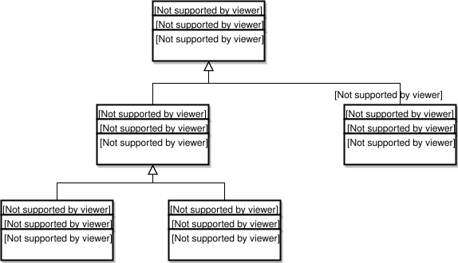
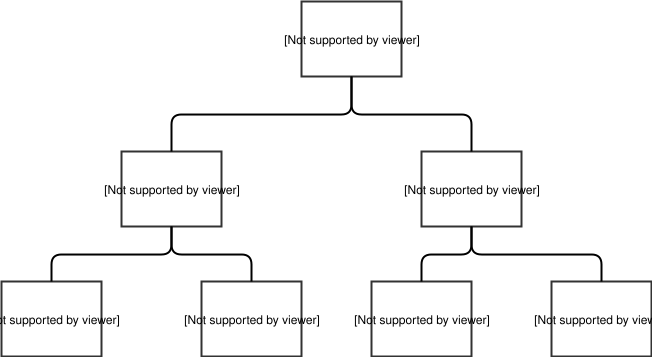
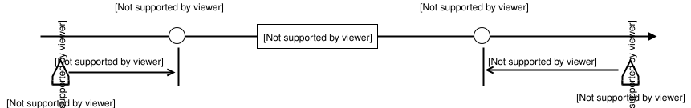

# Gateway Traffic Data Archive

## Preamble

The Gateway traffic data archive is a project that was put together for archiving traffic data from the Gary-Chicago-Milwaukee Gateway system. The Gateway system allows one to access traffic data in gzip'd XML format. There are several XML files available: congestion, travel times, vehicle detector station (VDS) data, construction, special events, and incidents.

## Availability

### Real-Time Data

Data provided by our real-time feeds are packaged as gzip'd XML files. Please refer to [XML and Camera Image Download Manual](xml-and-camera-image-download-manual.md) for details.

To register for a download account:

1. Go to [https://go.travelmidwest.com/register](https://go.travelmidwest.com/register).
1. Select the checkbox labeled `**XML Data Feed and Camera Images**`.
1. Complete the remainder of the registration form.

### Archived Data

> [!NOTE]
> Due to the growing size of our traffic data archive, only the past 24 hours of data are available for immediate download. As of December 31, 2023 the compressed archive contains over 29.5 million files totaling approximately 8.4 TiB (roughly more than 50 TiB uncompressed).
>
> Please contact us at [traffic-data-archive@travelmidwest.com](mailto:traffic-data-archive@travelmidwest.com?subject=Traffic%20data%20archive%20bulk%20transfer%20request) to arrange for bulk transfer onto portable storage, e.g. USB drives.
>
> When requesting more than a year's worth of data, we recommend:
>
> - Formatting drives as [FAT](https://en.wikipedia.org/wiki/File_Allocation_Table) or [BTRFS](https://en.wikipedia.org/wiki/Btrfs) instead of [NTFS](https://en.wikipedia.org/wiki/NTFS) if at all possible because NTFS does not perform as well with large numbers of small files.
> - [CMR](https://en.wikipedia.org/wiki/Perpendicular_recording) instead of [SMR](https://en.wikipedia.org/wiki/Shingled_magnetic_recording) hard drives, or even better, [solid-state drives (SSD)](https://en.wikipedia.org/wiki/Solid-state_drive).
> - Consider using internal SATA HDD/SSD drives instead of USB connected drives if transfer speed is important.
> - Allow for a turnaround time of at least a few days, perhaps more, depending on the volume of data requested, transfer method and/or storage medium.

Navigating the data archive:

- Data prior to March 10, 2007 is stored slightly differently from files after that date. Prior to March 10, 2007, there are 24 “hour” directories in each “day” directory. There are no sub-directories for each type of data, they are all located in the “hour” directory.
- After March 10, 2007, there is a per-year subdirectory (as of this document's writing, the archive spans the years 2007 thru 2023).
- Each year's subdirectory contains a per-month subdirectory. The monthly subdirectories are 2008/01, 2008/02, ... 2008/12, etc.
- Each monthly subdirectory in turn contains a per-day subdirectory.
- Within each daily subdirectory, there are subdirectories for each data type.
- We do not provide documentation for the raw data subdirectories `d4`, `d8`, `gai`, `indot`, `mdot`, `mndot`, and `wisdot`. Please contact the corresponding agencies for details regarding the information in their data feeds.

Archived files use the following naming scheme: `yyyy.MM.dd-hh.mm.ss-TYPE.gz`

| Field | Description |
| --- | --- |
| yyyy | 4-digit year |
| MM | 2-digit month |
| dd | 2-digit day of the month |
| hh | 00 to 23 |
| mm | 0 to 59 |
| ss | 0 to 59 |
| TYPE | travel / dms / har / vds / incidents / special / congestion |

| **Directory** | **Description** |
| --- | --- |
| announcements | Press releases related to road closures |
| congestion | High, medium, low congestion data for each link on the map. Includes link's start/end lat/long, link status, congestion value, speed and a timestamp |
| construction | Road work information (some of the data in these files is for future road work) |
| d4 | Raw data files from IDOT District 4, before they get converted into standard formats in congestion, construction, dms, incidents, traffic and vds sub-directories |
| d8 | Raw data files from IDOT District 8, before they get converted into standard formats in congestion, construction, dms, incidents, traffic and vds sub-directories |
| detailed_congestion | Similar to congestion sub-directory, except XML files also contain speed data |
| dms | Dynamic message sign text status and location |
| gai | Raw data files from IDOT's GettingAroundIllinois.com, before they get converted into standard formats in congestion, construction, dms, incidents, traffic and vds sub-directories |
| incidents | Active incident location, type, and lanes affected |
| indot | Raw data files from InDOT, before they get converted into standard formats in congestion, construction, dms, incidents, traffic and vds sub-directories |
| map | Gateway traffic map. |
| mdot | Raw data files from MDOT, before they get converted into standard formats in congestion, construction, dms, incidents, traffic and vds sub-directories |
| mndot | Raw data files from MnDOT, before they get converted into standard formats in congestion, construction, dms, incidents, traffic and vds sub-directories |
| motd | Message of the day archive - text messages that appear at the top of travelmidwest.com - mostly contains incident information from incidents sub-directory |
| traffic | Travel time for selected expressway routes. The start lat/long, end lat/long, travel time (in seconds), link length (in meters), and average speed (in m/s) are included |
| vds | Vehicle detector station (VDS) data. Includes sensor's lat/long location, satus, occupancy percentage and volume of vehicles over last 60 minutes per lane. |
| wisdot | Raw data files from WisDOT, before they get converted into standard formats in congestion, construction, dms, incidents, traffic and vds sub-directories |

## Data Definitions

The following data definitions were copied from the “Gateway External Interface User Guide”. The data definitions are given in CORBA Interface Definition Langauge format, but with few exceptions the fields are an exact 1-to-1 match with the tags present in the XML files.

### RoadwayEvent

Incident, construction (a.k.a. road work) and special events all share a common set of fields from the RoadwayEvent definition. These fields are placed in the <parent> tag of the om.gcmtravel.IncidentReportElement tag.



The RoadwayEvent fields are located in the <parent> tag of an incident and the the <parent> tag of ScheduledEvent (which is itself a <parent> tag in construction and special event).

The fields of a RoadwayEvent are:

```
struct RoadwayEvent {
  EventType type;
  string comments;
  EventConfidenceLevel confidenceLevel;
  string description;
  string roadwayEventID;
  StringList rawIDs;
  StringList mergedWith;
  RoadwayLocationList locations;
  EventSeverity severity;
  Time lastUpdateTime;
  EventState state;
  LocationResolutionStatus locStatus;
  FieldDataValidationStatus dataStatus;
  StringList operators;
};
```

#### type

The event type for the Roadway Event data structure is defined by the following enum:

```
enum EventType { INCIDENT_EVENT_TYPE, ROADWORK_EVENT_TYPE, SPECIAL_EVENT_TYPE, OTHER_EVENT_TYPE };
```

#### confidenceLevel

```
enum EventConfidenceLevel { UNKNOWN_EVENT_CONFIDENCE_LEVEL, LOW_EVENT_CONFIDENCE_LEVEL, MEDIUM_EVENT_CONFIDENCE_LEVEL, HIGH_EVENT_CONFIDENCE_LEVEL };
```

#### description

This is a free form text field that briefly describes the incident.

#### roadwayEventID

The roadwayEventID field uniquely identifies the incident across multiple files/downloads. The roadway event data structure contains this unique ID which is made up of two substrings. The first part is a standard abbreviation of the agency that originated the report. The following are tentatively defined:

| idprefix | name |
| --- | --- |
| GCM-GATEWAY | Gateway |
| GCM-OTHER | Other |
| IL-CDOT | Chicago DOT |
| IL-COMMCENTER | ComCenter |
| IL-IDOT | IDOT |
| IL-ISTHA | ISTHA |
| IL-LAKECOUNTY | Lake County |
| IL-OEMC | Chicago OEMC |
| IL-QC | Quad Cities (Illinois) |
| IL-SKYWAY | Skyway |
| IL-TESTTIMS | ISTHA TIMS |
| IL-TESTTSC | IDOT |
| IL-TIMS | ISTHA |
| IL-TSC | GCM-GATEWAY-TSC |
| IN-InDOT | InDOT |
| IN-ITR | Indiana Toll Road |
| MI-MDOT | MDOT |
| WI-MNT_XML_V001 | WisDOT Monitor |
| WI-WisDOT | WisDOT |

The second part of the roadway event ID is a string that uniquely identifies the event within the reporting agency.

#### rawIDs

Contains rawIDsElement tags. The rawID(s) are the IDs assigned by the data source(s). The Gateway assigns its own ID for accounting purposes as it processes the event. See the discussion of roadway event IDs above.

#### mergedWith

Contains mergedWithElement tags. These indicate the incident roadwayEventID of events that were fused together by the Gateway into the containing event. Merging is a very rare occurrence.

#### locations

Contains one or more locationElement tags describing the locations of the event. Incidents usually have one locationElement tag. Construciton and special event data may have two locationElement tags, one for each side of the road. It is rare that there are more than two locationElement tags.

#### severity

The Gateway operators have a set of fairly simple guidelines to determine severity. The severity keys on no lanes closed, one lane closed, or more than one lane closed.

Severity for roadway closures during the daytime, 5:00 AM to 9:00 PM:

- Major: more than one lane closed
- Medium: exactly one lane closed
- Minor: no lanes closed (shoulders only)

Severity for roadway closures during the evening, 9:00 PM to 5:00 AM:

- Major: all lanes closed
- Medium: more than one lane closed
- Minor: one lane or no lanes closed (shoulders only) Severity for ramp closures
- Major: all lanes closed on a ramp from an expressway to an expressway
  - Medium: all lanes closed on an entrance or exit (i.e., a ramp to an expressway from an arterial or from an expressway to an arterial)
- Minor: some lanes and/or shoulders closed

If a roadway closure spans both daytime and evening hours, use the definition from the daytime hours.

There are times when the location of a closure will cause a greater impact than the standard rules provide for and the operators make an informed decision to upgrade or downgrade a severity.

```
enum EventSeverity { UNKNOWN_EVENT_SEVERITY, NONE_EVENT_SEVERITY, MINOR_EVENT_SEVERITY, MEDIUM_EVENT_SEVERITY, MAJOR_EVENT_SEVERITY };
```

#### lastUpdateTime

Number of milliseconds since midnight January 1, 1970 to when the event information was last updated. This value works well with the Java java.util.Date class which has a constructor that takes this value as an argument.

#### state

This is //not //the geographic state such as Illinois. The event state is the way in which the event exists in the Gateway system. It can be a new event arrived at by automatic or manual fusion. It can be a new event resulting from manual intervention where the previous event had an unresolvable location. An event can be resurrected when it was supposed to be over according to previous data, but is not over.

Events can be updated as new relevant data is received and fused with an existing event. An event can be canceled when the previous report was false. Events can expire or be closed according to data received in a report about when they will no longer exist. There can be events in the system that are about to be deleted with that event state.

Where there has been operator intervention in the entering of the event into the system, a list is kept of the names of the operators involved.

The IDL for the event state is as follows:

```
enum EventState { EVENT_NEW_AUTO, EVENT_NEW_MANUAL,
EVENT_NEW_FROM_UNRESOLVABLE_MANUAL, EVENT_RESURRECTED_AUTO, EVENT_RESURRECTED_MANUAL, EVENT_UPDATED_WITH_NEW_SOURCE_DATA_AUTO, EVENT_UPDATED_AS_RESULT_OF_MERGE_AUTO, EVENT_UPDATED_AS_RESULT_OF_MERGE_MANUAL, EVENT_UPDATED_MANUAL, EVENT_CANCELED_AS_RESULT_OF_MERGE_AUTO, EVENT_CANCELED_AS_RESULT_OF_MERGE_MANUAL, EVENT_CANCELED_BY_SOURCE_AUTO, EVENT_CANCELED_BY_SOURCE_MANUAL, EVENT_TIME_EXPIRED_AUTO, EVENT_CLOSED_MANUAL, EVENT_CLOSED_BY_SOURCE_AUTO, EVENT_DELETION_IMMINENT
};
```

#### locStatus

The Gateway attempts to resolve locations by finding their precise meaning and translating them into a common basic type, namely the geometry point profile. Correction of transmission mal-formation is done, if possible. Resolution proceeds by manual or automatic procedure. Success is indicated by a location resolved status, while lack of success is indicated by a unresolvable status. The "Location not validated" status is a pre-resolution status indicating that resolution must still be done.

The IDL for these enums is as follows:

```
enum LocationResolutionStatus { LOCATION_NOT_VALIDATED, LOCATION_UNRESOLVABLE_AUTO, LOCATION_UNRESOLVABLE_MANUAL, LOCATION_CORRECTED_AND_RESOLVED_AUTO, LOCATION_CORRECTED_AND_RESOLVED_MANUAL, LOCATION_RESOLVED_MANUAL, LOCATION_RESOLVED_AUTO };
```

#### dataStatus

Data can be corrected when recovery is made of data that was meant to be an ascertainable valid entry, but was mis-entered or mis-transmitted. The data recovery can be by manual or automatic procedures. Data can be validated by being found to be within expected bounds, and infeasible if not. It can also be pre-validation, before any validation procedure has been applie

```
enum FieldDataValidationStatus { FIELD_DATA_NOT_VALIDATED, FIELD_DATA_INFEASIBLE_FOUND_AUTO, FIELD_DATA_INFEASIBLE_FOUND_MANUAL, FIELD_DATA_CORRECTED_AUTO,
FIELD_DATA_CORRECTED_MANUAL, FIELD_DATA_VALIDATED_AUTO, FIELD_DATA_VALIDATED_MANUAL
};
```

#### operators

Contains sub tags, if any, for each operator who entered information about the event.

### com.gcmtravel.IncidentReport

This tag contains zero or more <com.gcmtravel.IncidentReportElement> tags, one for each active incident at the time the XML file was saved.

### com.gcmtravel.IncidentReportElement

Defines an active incident with the following subtags/fields:

```
struct Incident {
  IncidentCounts counts;
  DetectionType type;
  unsigned short fatalityCount;
  IncidentFeatures features;
  unsigned short injuryCount;
  RoadwayCondition condition;
  RoadwayEvent parent; // parent struct IncidentTimes times;
  VerificationType verification;
  WeatherCondition weather;
};
```

#### counts

Counts of possible vehicle types involved in the incident are to be given:

```
struct IncidentCounts {
 unsigned short automobileCount;
 unsigned short bicycleCount;
 unsigned short busCount;
 unsigned short constructionVehicleCount;
 unsigned short dotVehicleCount;
 unsigned short heavyTruckCount;
 unsigned short lightTruckCount;
 unsigned short motorcycleCount;
 unsigned short motorhomeCount;
 unsigned short otherVehicleCount;
 unsigned short pedestrianCount;
 unsigned short tractorCount;
 unsigned short trainCount;
 unsigned short unknownTypeVehicleCount;
};
```

 The counts are unused in the 8 year history of the archive. No agency provides this level of detail.

#### type

Various possibilities for how incident was detected:

```
enum DetectionType { UNKNOWN_DETECTION_TYPE, DETECTED_BY_POLICE, DETECTED_BY_TRANSIT, DETECTED_BY_HIGHWAY_PATROL,
DETECTED_BY_CCTV, DETECTED_BY_AERIAL_SURVEILLANCE, DETECTED_BY_AUTOMATED_DETECTION, DETECTED_BY_TRAFFIC_INFO_SERVICES, DETECTED_BY_COMMERCIAL_FLEET_OPERATOR, DETECTED_BY_OTHER_PUBLIC_AGENCY, DETECTED_BY_CITIZEN, OTHER_DETECTION_TYPE
};
```

The type is usually set to “UNKNOWN_DETECTION_TYPE” for ComCenter and WisDOT events and “DETECTED_BY_OTHER_PUBLIC_AGENCY” for Illinois Tollway events.

#### features

Certain features are important analytical indices of roadway incidents: The incident data structure indicates whether these features are present:

```
struct IncidentFeatures { boolean hasAnimalCarcass; boolean hasAnimalHit; boolean hasCargoSpill; boolean hasDebris;
 boolean hasDisabledVehicle; boolean hasEarthquake; boolean hasEntrapment; boolean hasFallenTree;
 boolean hasFallenUtilityStructure; boolean hasFlood;
 boolean hasHazmat; boolean hasIce; boolean hasLiveAnimal;
 boolean hasMedicalAssistanceNeeded; boolean hasMudslide;
 boolean hasPedestrianHit; boolean hasPedestrianInRoadway; boolean hasOtherBlockage; boolean hasOtherPropertyDamage; boolean hasRoadsideDistraction; boolean hasRoadsideObjectFire;
 boolean hasRoadwayStructureDamage; boolean hasSnow;
 boolean hasStoppedVehicle; boolean hasVehicleFire; boolean hasVehicleOverturned;
 boolean hasVehicleRoadsideObjectCollision; boolean hasVehicleVehicleCollision; boolean hasTruckJackKnifed;
 boolean isAccident; boolean isHitAndRun; boolean isInWorkZone; boolean isPoliceAction; boolean isTrafficStop;
};
```

These values are rarely set properly, if at all, and should be viewed with suspicion.

#### condition

```
struct RoadwayEvent {
 EventType type;
 string comments;
 EventConfidenceLevel confidenceLevel;
 string description;
 string roadwayEventID;
 StringList rawIDs;
 StringList mergedWith;
 RoadwayLocationList locations;
 EventSeverity severity;
 Time lastUpdateTime;
 EventState state;
 LocationResolutionStatus locStatus;
 FieldDataValidationStatus dataStatus;
 StringList operators;
};
```

Indication of possible roadway conditions:

```
enum RoadwayCondition { UNKNOWN_ROADWAY_CONDITION, NONE_ROADWAY_CONDITION, DRY, WET, CHEMICAL_WET, SNOW_ICE, WET_ICY, WET_OIL_SLICK, WET_HIGH_WATER, OTHER_ROADWAY_CONDITION };
```

This is almost always set to UNKNOWN_ROADWAY_CONDITION.

#### parent

The <parent> tag contains fields that are common to all road way events such as construction, special events and incidents. See the section on RoadwayEvent above.

#### times

A series of relevant times are to be reported:

```
struct IncidentTimes {
 Time occurrenceTime;
 Time detectionTime;
 Time verificationTime;
 Time movedTime;
 Time clearedTime;
 Time closedTime;
 Time archivedTime;
 Time estimatedClosureTime;
};
```

Note that Time is the number of milliseconds since midnight January 1, 1970. A value of 0 would normally correspond to January 1, 1970 at midnight, but this value is reserved to mean “unknown date and time”. The meanings of the various sub-elements can be taken from the names:

| Field | Meaning |
| --- | --- |
| occurrenceTime | Time the incident occurred. Usually the same as detectionTime since the exact occurrence is almost always unknown. |
| detectionTime | When the incident was detected, only set by the Illinois Tollway, other sources set this to 0 (unknown). |
| verificationTime | When the incident was independently verified, only set by the Illinois Tollway, other sources set this to 0 (unknown). |
| movedTime | When the incident was moved off the roadway lanes, almost always set to 0 (unknown). |
| clearedTime | When the lanes of traffic were cleared. Usually 0 (unknown). |
| closedTime | When the incident was “closed” by the reporting agency. This usually means al the road way lanes are clear for traffic. |
| archivedTime | When the incident was removed from the database. Always 0 (unknown). |
| estimatedClosureTime | The time the agency estimated the incident would be closed. |

#### verification

The incident data structure provides for information about how the incident is verified:

```
enum VerificationType { UNKNOWN_VERIFICATION_TYPE, VERIFIED_BY_POLICE, VERIFIED_BY_TRANSIT, VERIFIED_BY_HIGHWAY_PATROL, VERIFIED_BY_CCTV, VERIFIED_BY_AERIAL_SURVEILLANCE, VERIFIED_BY_TRAFFIC_INFO_SERVICES, VERIFIED_BY_COMMERCIAL_FLEET_OPERATOR, VERIFIED_BY_OTHER_PUBLIC_AGENCY, OTHER_VERIFICATION_TYPE
};
```

Almost always set to OTHER_VERIFICATION_TYPE or UNKNOWN_VERIFICATION_TYPE.

#### weather

Relevant weather condition:

```
enum WeatherCondition { UNKNOWN_WEATHER_CONDITION, NONE_WEATHER_CONDITION, HEAVY_RAIN, LIGHT_RAIN, FOG, HAIL, SNOW, HIGHWIND, OTHER_WEATHER_CONDITION };
```

Almost always set to UNKNOWN_WEATHER_CONDITION or UNKNOWN_WEATHER_CONDITION.

### FieldDevice

This structure contains fields that are common to both vehicle detector stations (VDS) and dynamic message signs (DMS). It is stored in the <parent> tag of com.gcmtravel.VDSReportElement and com.gcmtravel.DMSReportElement.

The fields of FieldDevice (<parent>) are:

```
struct FieldDevice {
 FieldDeviceStatus deviceStatus;
 string fieldDeviceID;
 DeviceType type;
 PointLocation location;
 string owningAgencyID;
 LocationResolutionStatus locStatus;
 FieldDataValidationStatus dataStatus;
 Time lastUpdateTime;
 Time locationTimeStamp;
};
```

#### deviceStatus

Indicates the operational status of the field device:

```
enum FieldDeviceStatus { UNKNOWN_FIELD_DEVICE_STATUS, NONE_FIELD_DEVICE_STATUS, OPERATIONAL, OPERATIONAL_BUT_DEGRADED, NON_OPERATIONAL, COMMUNICATIONS_FAILURE, DOWN_FOR_MAINTENANCE };
```

The volume, occupancy and speed should be viewed with suspicion if the deviceStatus is anything but OPERATIONAL.

#### fieldDeviceID

This uniquely identifies the device within the Gateway system. This is composed of a prefix for the data source (see the section above about roadwayEventID) followed by a unique string for that data source and device.

#### type

```
enum DeviceType { VDS_DEVICETYPE, DMS_DEVICETYPE,HAR_DEVICETYPE, WSS_DEVICETYPE, OTHER_DEVICETYPE };
```

#### location

This is a point location representing the location of the device.

#### owningAgencyID

This is the prefix portion of the fieldDeviceID. See the section above about roadwayEventID for the meaning of the various values this field can have.

#### locStatus

The Gateway attempts to resolve locations by finding their precise meaning and translating them into a common basic type, namely the geometry point profile. Corrections are done, if possible. Resolution proceeds by manual or automatic procedure. Success is indicated by a location resolved status, while lack of success is indicated by a unresolvable status. The "Location not validated" status is a pre- resolution status, meaning the Gateway has not tried to resolve the location.

The Gateway will not display data on its website if it is not validated or resolved. It will, however, include the data in its XML data files.

```
enum LocationResolutionStatus { LOCATION_NOT_VALIDATED, LOCATION_UNRESOLVABLE_AUTO, LOCATION_UNRESOLVABLE_MANUAL, LOCATION_CORRECTED_AND_RESOLVED_AUTO, LOCATION_CORRECTED_AND_RESOLVED_MANUAL, LOCATION_RESOLVED_MANUAL, LOCATION_RESOLVED_AUTO };
```

#### dataStatus

All data entering the Gateway is validated to insure that it is correct and doesn't contain any “out of bounds” or impossible values. For instance, data that is supposed to be real-time but with a time stamp more than a few minutes old is considered to be problematic and will be marked FIELD_DATA_INFEASIBLE_FOUND_AUTO.

```
enum FieldDataValidationStatus { FIELD_DATA_NOT_VALIDATED, FIELD_DATA_INFEASIBLE_FOUND_AUTO, // not corrected FIELD_DATA_INFEASIBLE_FOUND_MANUAL, // not corrected FIELD_DATA_CORRECTED_AUTO, FIELD_DATA_CORRECTED_MANUAL, FIELD_DATA_VALIDATED_AUTO, FIELD_DATA_VALIDATED_MANUAL };
```

Internally, the Gateway also may mark data as “questionable” which means some value exceeded a threshold, but not by much. Many other checks are performed by the Gateway:

- Update latency < 5 minutes
- Maximum per lane volume of 2,200 vehicles/lane/hr
- Maximum occupancy 90%
- Maximum speed 80 mph
- Speed equals distance divided by travel time, (speed – distance / traveltime) / speed < 20%
- Maximum vehicle counts < 100 (for incidents)
- Properly formatted fieldDeviceID
- Device status is operational
- Time stamps are in the past (allowances are made for clock skew)
- detectorizationRatio between 0 and 1 inclusive

#### lastUpdateTime

This is the time, in milliseconds since midnight on January 1, 1970, that the device last sent or received data from its owning agency.

#### locationTimeStamp

This is the time, in milliseconds since midnight on January 1, 1970, that the device's location was last changed. The Gateway uses this to determine if it needs to resolve the device's location again or if it can use the last known resolved location.

#### com.gcmtravel.VDSReport

This tag contains one or more com.gcmtravel.VDSReportElement sub-tags, one for each known vehicle detector station known to the Gateway at the time the file was saved.

#### com.gcmtravel.VDSReportElement

Defines a vehicle detector station with the following sub-tags:

```
struct VDS {
 FieldDevice parent; // parent struct VDSType vdsType;
 unsigned short volume; //veh/lane/hr
 float occupancy; //percentage
 float speed; //meter/second
 boolean isSpeedTrap;
 float detectorizationRatio; //percentage of lanes that are detectorized
};
```

See the section on FieldDevice above for the meaning of the <parent> field and its sub-fields/tags.

#### vdsType

This defines the type of vehicle detector station.

```
enum VDSType { UNKNOWN_VDS_TYPE, LOOP, VISION, ACOUSTIC, INFRARED, RADAR, MICROWAVE, OTHER_VDS_TYPE };
```

This is almost always set to LOOP.

#### volume

This is the volume of vehicles flowing over the sensor in vehicles per lane per hour at the time the file was saved. This is typically a five minute moving average of minute-based data.

#### occupancy

This is a percentage measure (between 0 and 100) of how often the sensor has a vehicle positioned over it.

#### speed

This is the speed of vehicles moving over the sensor in meters per second. This is typically a five minute average of minute-based data.

#### isSpeedTrap

Indicates two successive detectors have been used to compute a more accurate speed.

#### detectorizationRatio

Ratio of lanes that have detectors to total lanes (0.0 to 1.0).

#### parent

This tag contains sub-tags that are common to VDS and DMS:

```
struct FieldDevice {
 FieldDeviceStatus deviceStatus;
 string fieldDeviceID;
 DeviceType type;
 PointLocation location;
 string owningAgencyID;
 LocationResolutionStatus locStatus;
 FieldDataValidationStatus dataStatus;
 Time lastUpdateTime;
 Time locationTimeStamp;
};
```

See the FieldDevice section above.

### Locations

The Gateway specification for roadway locations provides accurate, unambiguous, yet concise and flexible ways to specify locations in a roadway network. While based on the Location Reference Message Specification (LRMS), the Gateway location specification has been specifically developed for applications that adopt CORBA as the Center-to-Center (C2C) communications protocol. The Gateway specification significantly enhances the LRMS specification by inclusion of a comprehensive method for referencing cross-sectional components of the roadway.

A full roadway location specification includes a specification of a position along a roadway and a cross-sectional position in the road or off to the right or left of the roadway. The position along the roadway is called the linear location and may be a point location or a length of roadway called a section or link. The cross-sectional position is used for specifying an effect or intensity of effect of an event that is localized to a particular lane or part of the roadway.



Roadway locations are linear when the “point location” on a road is all that needs to be specified, or a “section” of road involving two points is required to say where a measurement or event took place. (A section is always a continuous, connected piece of road.) When in addition, a location within or off the side of a road is needed, the location is specified with a “lane” description. A roadway location can be linear, or can be a linear location together with a lane location. Below we have a diagram of these relationships:

Linear locations in the Gateway IDL can be precisely specified or described by use of one of nine profiles which are:

1. LatLong
1. Landmark
1. Address
1. Mile marker
1. Cross street
1. Ramp
1. Between cross streets
1. Geometry
1. Text

In the following sections we show how each of these profiles are is used to give a precise linear, point and section locations. In a particular situation they may be considered alternatives, or a particular location may be specified redundantly with two or more profiles. A reporting data source may choose to use one or the other because it is simpler or more natural in their situation. The text profile may be a last resort for an observer when none of the other profiles apply when data is being reported. When a textual report has been supplied, a redundant specification of the location by another observer may make the location precise for the Gateway. If no other profile is provided, a manual intervention by operator may be required to make the location precise. The text profile is often the preferred way to distribute information from the Gateway in a humanly understandable form.

#### Common elements of locations

Roadway locations have certain common elements that we explain now before going on to explain the variations for each profile. Location reports typically include the roadway name, the roadway direction, and the roadway type. The roadway name is a **struct **containing two **string**s and two uses of the StreetNameAffix **enum**. The **string**s are the name by which the roadway roadway is known, and a type, called the streetType, such as "Road", "Drive" or "Lane". The prefix StreetNameAffix is for specifications like "N.", "S.", "SE". In some areas this information is after the StreetName, while in others it is before. The IDL is as follows:

```
enum StreetNameAffix {
 NONE,
 N,
 NE,
 E,
 SE,
 S,
 SW,
 W,
 NW
};
```

```
struct RoadwayName {
 string name;
 StreetNameAffix prefix;
 StreetNameAffix suffix;
 string streetType;
};
```

The possibilities for roadway type are given in the following **enum**:

```
enum RoadwayType {
 UNKNOWN_ROADWAY_TYPE,
 FREEWAY,
 FREEWAY_EXPRESS,
 FREEWAY_HOV,
 FREEWAY_REVERSIBLE,
 ARTERIAL,
 LOCAL_ROAD,
 RAMP,
 OTHER_ROADWAY_TYPE
};
```

The roadway direction is required in profiles specifying a location with an offset, or when specifying lanes in a bi-directional roadway. The RoadwayDirectionType, defined in the IDL below, allows the user to specify the eight general direction types. A local direction is determined by the actual direction of the roadway in a localized area in which the event being described is located. In most situations, local and global directions will agree with each other. When they differ, a global direction should be used. The global direction may vary with the type of a roadway: For an Interstate highway, the direction to be selected is the national designation; and, for a state highway, the direction is the corridor-wide direction.

```
enum RoadwayDirectionType { UNKNOWN_DIRECTION_TYPE, EAST_BOUND, WEST_BOUND, SOUTH_BOUND, NORTH_BOUND, SOUTH_EAST_BOUND, SOUTH_WEST_BOUND, NORTH_EAST_BOUND, NORTH_WEST_BOUND };
```

Designation of a direction gives a referential basis for other encoding done by the observer. In profiles that use an offset to show the distance from a landmark, or cross street, or along a ramp, the offset is positive in the direction given and negative in the opposite direction.

An additional piece of information that is typically required is the Federal Information Processing Standard (FIPS) code of the roadway. The FIPS refers to the area or jurisdiction the location is in. The IDL for the FIPS is the following struct:

```
struct FIPSCode {
 unsigned long stateCode;
 unsigned long countyCode;
 unsigned long cityCode;
};
```

With this as background we discuss the use of each profile for locating a roadway point or section.

#### LatLongPoint and LatLongSection

In the specification of a linear point location by LatLong (latitude and longitude) you record the values of latitude and longitude in microdegrees along with the format of the measurement. The linear section location by LatLong requires the specification of two points with one designated the start and the other the end according to the direction of the roadway:

```
typedef long Latitude; // in microdegrees
typedef unsigned long Longitude; // in microdegrees
enum HdatumType {
 NAD27,
 NAD83,
 WGS84,
 WGS84_PLUS_EGM96,
 OTHER_HDATUM_TYPE
};
struct LatLong {
 Latitude latitude;
 Longitude longitude;
 HdatumType hDatum;
};
struct LatLongPoint {
 RoadwayName roadName;
 RoadwayDirectionType direction;
 RoadwayType type;
 LatLong coord;
};
struct LatLongSection {
 RoadwayName roadwayName;
 RoadwayDirectionType direction;
 RoadwayType roadwayType;
 LatLong startLatLong;
 LatLong endLatLong;
};
```

The LatLongSection is illustrated by the following diagram:


#### LandmarkPoint and LandmarkSection

A linear point location can be specified by reference to a landmark. A landmark has a name represented by a string. The location by landmark uses an offset measured in the direction of the roadway. An example of location by landmark would be “300 feet North from the water tower on Interstate 88”. A linear section location based on landmarks has a pair of landmark names and offsets for points designated start and end. It allows for the possibility of two FIPS codes designated start and end.

```
struct LandmarkPoint {
 RoadwayName roadwayName;
 RoadwayDirectionType direction;
 RoadwayType roadwayType;
 FIPSCode fipsCode;
 string landmarkName;
 float offset;   // in meters
};
struct LandmarkSection {
 RoadwayName roadwayName;
 RoadwayDirectionType direction;
 RoadwayType roadwayType;
 FIPSCode startFipsCode;
 FIPSCode endFipsCode;
 string startLandmarkName;
 float startOffset;  // in meters
 string endLandmarkName;
 float endOffset;    // in meters
};
```

The following is a diagram of the LandmarkSection:



#### AddressPoint and AddressSection

The Address profile uses house numbers or addresses for locating points on the roadway. . The address numbering system is a well-known part of our locating system. The Gateway specification for an address is a string representing an unsigned integer. No offset is used with this method of location.

The specification for a section based on house numbers has a start house number and FIPS code and an end house number and FIPS code. The IDL specifications are:

```
struct AddressPoint {
 RoadwayName roadwayName;
 RoadwayDirectionType direction;
 RoadwayType roadwayType;
 FIPSCode fipsCode;
 string addressNumber;
};
 
struct AddressSection {
 RoadwayName roadwayName;
 RoadwayDirectionType direction;
 RoadwayType roadwayType;
 FIPSCode startFipsCode;
 FIPSCode endFipsCode;
 string startAddressNumber;
 string endAddressNumber;
};
```

The diagram for the address profile is as follows:

#### MilePointPoint and MilePointSection

A mile marker may be used to locate a point on a road. In the Gateway corridor, mile markers often have decimal parts making for more precise locations. The IDL for this profile requires a FIPSCode to be specified. (See the discussion above of common elements in locations.) To specify a section based on mile markers we use start and end mile markers and FIPS’s.

```
struct MilePointPoint {
 RoadwayName roadName;
 RoadwayDirectionType direction;
 RoadwayType type;
 FIPSCode fips;
 float milePoint;  // in meters!
};
 
struct MilePointSection {
 RoadwayName roadName;
 RoadwayDirectionType direction;
 RoadwayType type;
 FIPSCode startFipsCode;
 FIPSCode endFipsCode;
 float startMilePoint;  // in meters!
 float endMilePoint;    // in meters!
};
```

#### CrossStreetPoint and CrossStreetSection

A roadway location may be specified by reference to a cross street. The RoadwayName struct, RoadwayDirectionType, and RoadwayType of the cross street is used in this profile. An offset is measured from the cross street in the direction of the roadway to the point location. A FIPSCode is also required. The specification for a section based on the cross street profiles has a “from” cross street name, direction, and type and a “to” cross street name, direction, and type. Each has an offset and a FIPSCode. The IDL is:

```
struct CrossStreetPoint {
 RoadwayName roadName;
 RoadwayDirectionType direction;
 RoadwayType type;
 FIPSCode fips;
 RoadwayName crossStreetName;
 RoadwayType crossStreetType;
 RoadwayDirectionType crossStreetDirection;
 float offset;   // meters
};
 
struct CrossStreetSection {
 RoadwayName roadName;
 RoadwayDirectionType direction;
 RoadwayType type;
 FIPSCode startFipsCode;
 FIPSCode endFipsCode;
 RoadwayName fromCrossStreetName;
 RoadwayType fromCrossStreetType;
 RoadwayDirectionType fromStreetDirection;
 float startOffset;  // meters
 RoadwayName toCrossStreetName;
 RoadwayType toCrossStreetType;
 RoadwayDirectionType toStreetDirection;
 float endOffset;    // meters
};
```

The diagram for this profile is:


#### RampPoint and RampSection

The IDL specification for a linear ramp point location provides for a “from” roadway name, type, direction, and FIPS and for a “to” roadway name, type, direction and FIPS. An offset is provided for the distance along the ramp from the “from” roadway. The specification for a section by ramp points has a start offset and an end offset to define two ramp points. Start and end are defined by the direction of traffic along the ramp.

```
struct RampPoint {
 RoadwayName fromRoadwayName;
 RoadwayDirectionType fromDirection;
 RoadwayType fromRoadwayType;
 FIPSCode fipsCode;
 RoadwayName toRoadwayName;
 RoadwayDirectionType toDirection;
 RoadwayType toRoadwayType;
 float offset;
};
 
struct RampSection {
 RoadwayName fromRoadwayName;
 RoadwayDirectionType fromDirection;
 RoadwayType fromRoadwayType;
 FIPSCode fipsCode;
 RoadwayName toRoadwayName;
 RoadwayDirectionType toDirection;
 RoadwayType toRoadwayType;
 float startOffset;
 float endOffset;
};
```

The diagram of this profile shows a ramp from I-355 North to I-90 East. The start point is A and the end point is B.

<!-- TODO(docs): image 'image2017-11-6_8-36-5.png' is referenced here but the attachment no longer exists on the source wiki (404) -->

#### BetweenStreetPoint and BetweenStreetSection

Not used in the Gateway.

#### GeometryPoint and GeometrySection

A geometry point is defined by reference to a “segment ID”. This allows us to find the segment in a map database. The problem is that map databases are not standard and are often proprietary. Segment IDs are subject to change in different database versions and use of them imposes the a burden of synchronizing versions and updates. If everyone is on the same page, after obtaining a segment ID, locating a point using this method is done with an offset from the Ref node of the segment measured in the direction of the roadway specified in the SegmentDirectionType enum direction value. Segments have two nodes, the Ref Node and the Non-Ref Node The linear section location by geometry point uses two segment ID's and two offsets. There must be a continuous sequence of segments between the start segment whose ID is given and the end segment. The IDL for this profile is:

```
enum SegmentDirectionType { REF_TO_NONREF, NONREF_TO_REF };
struct GeometryPoint {
 SegmentDirectionType direction;
 string segmentID;
 float offset;
};
struct GeometryPoint {
 RoadwayDirectionType direction;
 string segmentID;
 float offset;
};
struct GeometrySection {
 SegmentDirectionType startSegmentDirection;
 string startSegmentID;
 float startOffset;
 string endSegmentID;
 float endOffset;
};
```

The profile is represented as follows:

<!-- TODO(docs): image 'image2017-11-6_8-38-10.png' is referenced here but the attachment no longer exists on the source wiki (404) -->

#### Text

Sometimes all you have is a description of the point or section, and the Gateway includes this possibility in its profile for designation by text. If none of the other profiles are possible, reports are submitted using a text description. The text profile may also be used to return a humanly accessible message to Gateway users.

#### Lane descriptions

A cross-sectional position in the road or off to the right or left of the roadway can be represented with a “lane desc” IDL specification. The cross-sectional LaneDesc location is used for specifying the effect or intensity of effect (LaneImpactType) of an event that is localized to a particular lane or part of the roadway. An example would be the closing of a particular lane because of blockage by a chemical spillage. To specify a location including the lane(s) affected, a location that includes a linear location and one or more LaneDesc(s) is used.

The basic part of the LaneDesc struct is the lane number designation. Lane numbers are an index to lanes based on the perspective of a driver going in particular direction on the roadway. The number 1 designates the leftmost lane serving traffic going in the same direction as our driver. The highest lane number is the index of the rightmost lane going in the same direction. A shoulder (right or left) is considered non-indexable and had a lane number of 0. If the lane number is unknown, it is given a negative index.

A location with lane specifications will have as many lane structs as there are lanes needing to be specified. Thus, the location of a chemical spillage closing three lanes of I240 would include three lanedesc strucs. In this regard shoulders are counted as lanes and require specification with a separate struct. An unspecified number of lanes is represented by one lane struct with an index of 99.

Each lane includes the lane type and lane impact type. The lane type enum shown below includes generic lanes, express lanes, HOV lanes, reversible lanes, off-road locations and all of these at once. With each type are sub-designations for left and right shoulders, entrance and exit lanes, and right and left designations for off-road locations. The lane impact types include closed, impassable, reduced speed and lane shifted conditions, along with unknown and none. These specifications overlap with lane numbers in some respects, but together the provide fine, grandular specifics of cross-sectional conditions.

The IDL for lanes follows this comentary. The lane types are extensive and it is appropriate that training be given personnel in the accurate reporting of lane types. For example if you have multiple lanes in each direction and a median strip, you can have shoulders on both sides of the lanes going in a single direction.

Using the roadway direction on Figure 3-10, the left shoulder position is in the center of the road as indicated. Likewise, an off the road left position is in the median left of the left shoulder. In the same way the position of the right shoulder is off the edge of the road as indicated. The location off the road to the right is beyond the right shoulder. Taking the roadway direction into account again, the left-most or innermost lane is lane 1, the second left most is lane 2, etc. By use of the lane direction types, the same distinctions can be made going the opposite direction, reversing the orientations of right and left. Left is, once again, to the center or inner part of the road, and right is toward the edge of the road. The IDL reflecting these explanations is the following:

```
enum LaneType { UNKNOWN_LANE_TYPE, LANE, LEFT_SHOULDER, RIGHT_SHOULDER, SHOULDER, EXPRESS_LANE,
EXPRESS_ENTRANCE_LANE, EXPRESS_EXIT_LANE, EXPRESS_CONNECTOR_LANE, LEFT_EXPRESS_SHOULDER, RIGHT_EXPRESS_SHOULDER, EXPRESS_SHOULDER, HOV_LANE, HOV_ENTRANCE_LANE, HOV_EXIT_LANE, HOV_CONNECTOR_LANE, LEFT_HOV_SHOULDER, RIGHT_HOV_SHOULDER, HOV_SHOULDER, REVERSIBLE_LANE, REVERSIBLE_ENTRANCE_LANE, REVERSIBLE_EXIT_LANE, REVERSIBLE_CONNECTOR_LANE, LEFT_REVERSIBLE_SHOULDER, RIGHT_REVERSIBLE_SHOULDER, REVERSIBLE_SHOULDER, OFF_ROAD_LEFT, OFF_ROAD_RIGHT,
OFF_ROAD, ALL_LANES
};
 
enum LaneImpactType { UNKNOWN_LANE_IMPACT,NONE_LANE_IMPACT, CLOSED, IMPASSABLE, SPEED_REDUCED, LANE_SHIFTED, OTHER_LANE_IMPACT };
 
struct LaneDesc {
 LaneType type;
 LaneImpactType laneImpact;
 short laneNumber;
};
 
typedef sequence<LaneDesc> LaneLocation;
typedef sequence<LaneLocation> LaneLocationList;
```

This diagram shows the layout and ordering of lane numbers for each side of an expressway with *n* lanes on one side and *m* lanes on the other:

|  |  |  |
| --- | --- | --- |
| ← | Right shoulder |  |
| ← | Lane 'n' |  |
| ← | . . . |  |
| ← | Lane 2 |  |
| ← | Lane 1 |  |
| ← | Left shoulder |  |
|  | -Median- |  |
|  | Left shoulder | → |
|  | Lane 1 | → |
|  | Lane 2 | → |
|  | . . . | → |
|  | Lane 'm' | → |
|  | Right shoulder | → |

#### LinearLocation

A data structure that is one of the above point specifications together with a tag for saying which, i.e. the union** **of the point specifications, is called a Point Location Profile (see above). In a similar manner the union** **of section specifications with a tag is the Section Location Profile. The **union **of point and section specifications is the Linear Location Profile:

```
enum SectionLocationType { LATLONG_SECTION, LANDMARK_SECTION, ADDRESS_SECTION, MILE_POINT_SECTION, CROSS_STREET_SECTION, RAMP_SECTION, BETWEEN_STREET_SECTION, GEOMETRY_SECTION, TEXT_SECTION, GENERIC_SECTION };
 
union SectionLocationProfile switch (SectionLocationType) {
 case LATLONG_SECTION: LatLongSection LatLongSection;
 case LANDMARK_SECTION: LandmarkSection landmarkSection;
 case ADDRESS_SECTION: AddressSection addressSection;
 case MILE_POINT_SECTION: MilePointSection milePointSection;
 case CROSS_STREET_SECTION: CrossStreetSection crossStreetSection;
 case RAMP_SECTION: RampSection rampSection;
 case BETWEEN_STREET_SECTION: BetweenStreetSection betweenStreetSection;
 case GEOMETRY_SECTION: GeometrySection geometrySection;
 case TEXT_SECTION: TextSection textSection;
 case GENERIC_SECTION: GenericSection genericSection;
};
 
typedef sequence<SectionLocationProfile> SectionLocation; typedef sequence<SectionLocation> SectionLocationList;
 
enum LinearLocationType { POINT_LINEAR, SECTION_LINEAR };
typedef sequence<LinearLocationType> LinearLocationTypeList;
 
union LinearLocation switch (LinearLocationType) {
 case POINT_LINEAR: PointLocation point;
 case SECTION_LINEAR: SectionLocation section;
};
 
typedef sequence<LinearLocation> LinearLocationList;
```

The IDL defines a list of Linear Locations and a list of the lists.

#### RoadwayLocation

The full power of the location specifications is brought to bear when a linear location is combined with a lane specification. The Linear Roadway Location specification sets out the position along a roadway, and the lane gives the cross-sectional position in the road or off to the right or left of the roadway. The IDL is as follows:

```
struct RoadwayLocation {
 LinearLocation linear;
 LaneLocation lane;
 string originalInput;
};
typedef sequence<RoadwayLocation> RoadwayLocationList; typedef sequence<RoadwayLocation> RoadwayLocationList;
```

The original input string component of the RoadwayLocation struct is for preserving the information the data provider entered that was converted to a location specification.

A list of Roadway Locations is specified as well in the usual manner.
