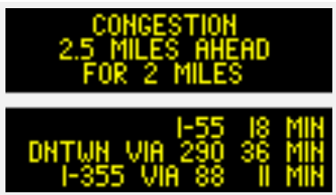

# XML and Camera Image Download Manual

## Introduction

### About

The **Gateway Traveler Information System (GTIS)** provides access to raw data for traffic, incident, closure and roadway device information via a [XML interface](gateway-external-interface-user-guide/README.md).

In addition, the Gateway system also supports downloading data in [GeoJSON](../gateway-api/README.md) format and roadside camera images.

### Purpose

There are a number of organizations and individuals who need traffic related data from the Gateway system for analysis and/or for presentation in a different format.

Many users have been using page-scraping programs to parse the HTML reports presented on the Travel Midwest website. Page-scraping results in additional system loads and network bandwidth usage on both ends of the connection. Furthermore, the website does not display all the fields present in the raw data. In order to reduce the load due to page-scraping and provide simpler access to the complete data, the Gateway system allows users to directly access the raw data in XML format, which is compressed for faster downloads. Camera images are also available for direct downloading.

### Obtaining an Account

To access the XML data or the camera images, you must have a Travel Midwest user account:

1. Go to [https://go.travelmidwest.com/register](https://go.travelmidwest.com/register)
1. Read and agree to the [IDOT Traffic Information Access/Reuse Policy page](https://go.travelmidwest.com/datareuse), then complete and submit the registration form.

You will receive an email notification stating whether your request for access has been approved or rejected. If it is approved and access to XML and camera images was requested, a link to this manual will be attached to that email.

As stated in the IDOT Traffic Information Access/Reuse Policy, you must keep your account information up to date, and must update your account at least annually:

1. Go to the administrative login page: [https://go.travelmidwest.com/login](https://go.travelmidwest.com/login)
1. Sign in with your login credentials.
1. Update any information as-needed and click the save/update button (even if there are no changes).

## XML Traffic Data

### Gateway Data Types

The following table lists the types of traffic data available in XML format to registered users of the Gateway system:

- Download access is via the HTTPS protocol with [basic access authentication](https://en.wikipedia.org/wiki/Basic_access_authentication).
- The document component of a URL, e.g. `VDSReport.xml.gz`, is the name of the XML file compressed in [gzip](https://en.wikipedia.org/wiki/Gzip) format.
- See the [Gateway XML Reference](gateway-external-interface-user-guide/gateway-xml-reference.md) section of the [Gateway External Interface User Guide](gateway-external-interface-user-guide/README.md) for schema information.

| Data Type | Information | Download URL |
| --- | --- | --- |
| **Detector** | Detector’s location, status, speed, volume and occupancy. | [https://travelmidwest.com/lmiga/VDSReport.xml.gz](https://travelmidwest.com/lmiga/VDSReport.xml.gz) |
| **Incident** | Traffic accidents and other unplanned events that impact traffic such as the time, location, impact, etc. | [https://travelmidwest.com/lmiga/IncidentReport.xml.gz](https://travelmidwest.com/lmiga/IncidentReport.xml.gz)<br>[https://travelmidwest.com/lmiga/IncidentReportV2.xml.gz](https://travelmidwest.com/lmiga/IncidentReportV2.xml.gz) |
| **Construction** | Lane closures due to construction. It describes the location, the time period, the impact on the roadway, and various other information about the closure. | [https://travelmidwest.com/lmiga/RoadWorkReport.xml.gz](https://travelmidwest.com/lmiga/RoadWorkReport.xml.gz) |
| **Special Event** | Events including sports and parades that can impact traffic. | [https://travelmidwest.com/lmiga/SpecialEventReport.xml.gz](https://travelmidwest.com/lmiga/SpecialEventReport.xml.gz) |
| **Congestion** | Congestion levels for routes on major roads across the Gateway coverage area. A larger detailed report includes volume, speed and occupancy. | [https://travelmidwest.com/lmiga/LinkCongestionReport.xml.gz](https://travelmidwest.com/lmiga/LinkCongestionReport.xml.gz)<br>[https://travelmidwest.com/lmiga/LinkCongestionDetailedReport.xml.gz](https://travelmidwest.com/lmiga/LinkCongestionDetailedReport.xml.gz) |
| **Travel Time** | Congestion level, travel time, and speed for routes on major roads across the Gateway coverage area. | [https://travelmidwest.com/lmiga/LinkTrafficReport.xml.gz](https://travelmidwest.com/lmiga/LinkTrafficReport.xml.gz) |
| **Dynamic Message Sign (DMS)** | Messages displayed on digital signs at various locations. | [https://travelmidwest.com/lmiga/DMSReport.xml.gz](https://travelmidwest.com/lmiga/DMSReport.xml.gz) |
| **Highway Advisory** | Any special advisories for specific locations in the Gateway coverage area. | [https://travelmidwest.com/lmiga/HARReport.xml.gz](https://travelmidwest.com/lmiga/HARReport.xml.gz) |

### XML Version

The root tag of the XML file may contain a "version" attribute that indicates the version of the XML file. Currently only the `IncidentReportV2.xml.gz` file includes a version attribute:

```xml
<com.gcmtravel.IncidentReport version="2.0">
 .
 .
 .
</com.gcmtravel.IncidentReport>
```

If no version attribute is present, then the XML file is assumed to be `version="1.0"`. The version attribute is absent in the original XML formats to maintain backward compatibility.

### XML Generation

The XML data generated by the Travel Midwest web servers is updated in real-time. For each type of data, the system creates an XML report into which it embeds the XML descriptions. The following example describes the XML data for detectors:

```xml
<com.gcmtravel.VDSReport>
 <com.gcmtravel.VDSReportElement>
  <!-- data for first detector -->
 </com.gcmtravel.VDSReportElement>
 <com.gcmtravel.VDSReportElement>
  <!-- data for second detector -->
 </com.gcmtravel.VDSReportElement>
...
</com.gcmtravel.VDSReport>
```

In the example above, the children of the `<com.gcmtravel.VDSReport>` element are `<com.gcmtravel.VDSReportElement>` elements, each of which contains information for a given detector.

Note:

- At this time, the XML data transmitted only contains public data and applies the same filtering rules used by the web reports. The filtering rules check the confidence level and other fields to ensure that the data is suitable for public viewing.
- The congestionLevel, locStatus and dataStatus fields must be examined to determine whether the other real-time data fields such as `travelTime`, `volume`, `speed` and `occupancy` are valid:
  - If `congestionLevel` is "UNKNOWN_CONGESTION_LEVEL", then the data is invalid.
  - If `locStatus` is "LOCATION_NOT_VALIDATED", "LOCATION_UNRESOLVABLE_AUTO", or "LOCATION_UNRESOLVABLE_MANUAL", then the data is invalid.
  - If `dataStatus` is "FIELD_DATA_NOT_VALIDATED", "FIELD_DATA_INFEASIBLE_FOUND_AUTO", or "FIELD_DATA_INFEASIBLE_FOUND_MANUAL", then the data is invalid.

### Downloading Gateway XML Data

Any compatible [HTTPS](https://en.wikipedia.org/wiki/HTTPS) client can be used for downloading Gateway XML data. This section provides tips and examples using a variety of methods.

#### Web Browser

The XML data for any of the types of traffic data can be downloaded by entering the associated URL in almost any web browser. The server validates the user credentials and returns the compressed XML file for saving. The user then decompresses the file and can open the result in any XML or text editor.

#### Wget

On Unix/Linux systems, GNU Wget is often installed by default or readily available. Versions are also available for macOS and Windows.

The following command downloads and saves the current travel times data (substitute a valid Gateway login name and password for <login> and <password>):

```console
wget --http-user=<login> --http-password=<password> https://travelmidwest.com/lmiga/LinkTrafficReport.xml.gz
```

#### Java

Any programming libraries that support HTTPS, HTTP basic access authentication and gzip compression can be used to download and uncompress the XML data. The following sample Java program accesses a Gateway XML feed and displays it on standard output:

```java
import java.io.*;
import java.net.*;
import java.util.zip.GZIPInputStream;
import javax.net.ssl.HttpsURLConnection;

/**
 *  This class demonstrates how to download XML data from the Travel Midwest web site.
 *  Usage is "XmlClient login password filename".  It prints the downloaded file to stdout.
 */
public class XmlClient {
  public static void main(final String[] args) {
    if (args.length < 3) {
      System.err.println("Usage: XmlClient user password filename");
      System.exit(0);
    }
    String url = "https://travelmidwest.com/lmiga/" + args[2];
    try {
      Authenticator.setDefault(new Authenticator() {
        @Override
        protected PasswordAuthentication getPasswordAuthentication() {
          return new PasswordAuthentication (args[0], args[1].toCharArray());
        }
      });
      HttpsURLConnection conn = (HttpsURLConnection) URI.create(url).toURL().openConnection();
      BufferedReader in = new BufferedReader(
        new InputStreamReader(new GZIPInputStream(conn.getInputStream())));
      String line;
      while ((line = in.readLine()) != null) {
        System.out.println(line);
      }
      in.close();
    }
    catch (Exception e) {
       e.printStackTrace();
    }
  }
}
```

The sample program above performs the usual operations for accessing a file via a URL. The only differences for secure access are that an Authenticator containing the login and password is registered and an HttpsURLConnection is used.

#### Python

Python and its libraries can download and process GTIS XML files directly from the Travel Midwest website. The following code uses the requests, gzip, pandas and minidom libraries to download the `DMSReport.xml.gz` file, convert it into a pandas DataFrame, then save each data source to its own Excel ([Office Open XML](https://en.wikipedia.org/wiki/Office_Open_XML)) spreadsheet file.

```python
import requests
from requests.auth import HTTPBasicAuth
import gzip
from io import BytesIO
import pandas as pd
import pandas_read_xml as pdx
from pandas_read_xml import flatten, auto_flatten, fully_flatten, auto_separate_tables
import time
from datetime import datetime, timezone
import xml.dom.minidom

# Provide username and password for TravelMidwest.com account
username = 'XXX'
password = 'XXX'
url = 'https://travelmidwest.com/lmiga/DMSReport.xml.gz'
package = 'com.gcmtravel.DMSReport'

def columnNameMapper(columnName: str) -> str:
  """This function renames the DataFrame columns to make them look a little nicer.

  Parameters
  ----------
  columnName - name of column as passed in from the pandas rename() method

  Returns
  -------
  str - new name for the column
  """
  if columnName.find(package+'Element|parent|location|locationElement|') == 0:
    return columnName[len(package+'Element|parent|location|locationElement|'):]
  elif columnName.find(package+'Element|parent|') == 0:
    return columnName[len(package+'Element|parent|'):]
  elif columnName.find(package+'Element|') == 0:
    return columnName[len(package+'Element|'):]
  return columnName

with requests.get(url, auth=HTTPBasicAuth(username, password), stream=True) as r:
  r.raise_for_status()
  xmlstr = gzip.decompress(data=r.content).decode('utf-8')
  with open('DMSReport.xml', 'w') as out:
    dom = xml.dom.minidom.parseString(xmlstr)
    out.write(dom.toprettyxml(indent='  '))
  df = pdx.read_xml(xmlstr, [ package ]).pipe(fully_flatten).rename(columns=columnNameMapper).set_index('fieldDeviceID')
  df['latLongPointLoc|coord|latitude'] = df['latLongPointLoc|coord|latitude'].astype(float) / 100000.0
  df['latLongPointLoc|coord|longitude'] = df['latLongPointLoc|coord|longitude'].astype(float) / 100000.0
  # errors='coerce' yields NaT for the out-of-range lastUpdateTime values that some
  # sources publish; datetime.fromtimestamp() raises OSError on those instead.
  # Both timestamp and age are UTC.
  df['timestamp'] = pd.to_datetime(df['lastUpdateTime'].astype(float), unit='ms', errors='coerce')
  df['age'] = pd.Timestamp.utcnow().tz_localize(None) - df['timestamp']
  # some DMS are missing fieldDeviceID values!   Drop those rows because they cause an error in source_data = line below
  df = df[~df.index.isna()]
  # fully_flatten will cause fieldDeviceID duplications when a DMS has more than one location profile, let's merge these together
  df = df.groupby(level=0).first()
  #df['timestamp'] = df['lastUpdateTime'].astype(float).apply(lambda t : pd.to_datetime(t))

prefixes = set()
for id in df.index.values:
  parts = id.split('-')
  prefixes.add(parts[0]+'-'+parts[1])

report_dicts = []
for idprefix in prefixes:
  source_data = df[df.index.str.contains(idprefix)]
  failed_validation = source_data[(source_data['dataStatus'] == 'FIELD_DATA_INFEASIBLE_FOUND_AUTO')]
  unresolved = source_data[~source_data['locStatus'].str.contains('LOCATION_RESOLVED')]
  old = source_data[(source_data['age'] > '15 minutes')]
  non_operational = source_data[(source_data['deviceStatus'] != 'OPERATIONAL')]
  report_dicts.append({'source': idprefix,
                       'failed_validation': failed_validation.shape[0],
                       'unresolved': unresolved.shape[0],
                       'old': old.shape[0],
                       'non_operational': non_operational.shape[0],
                       'total': source_data.shape[0],
                       })
  with pd.ExcelWriter('DMS-'+idprefix+'.xlsx') as writer:
    source_data.to_excel(writer, sheet_name=idprefix, freeze_panes=(1,1))
    old.to_excel(writer, sheet_name='Old', freeze_panes=(1,1))
    failed_validation.to_excel(writer, sheet_name='Failed Validation', freeze_panes=(1,1))
    unresolved.to_excel(writer, sheet_name='Unresolved', freeze_panes=(1,1))
    non_operational.to_excel(writer, sheet_name='Non-operational', freeze_panes=(1,1))

report = pd.DataFrame(data=report_dicts).set_index('source')
report.to_excel('Report.xlsx')
```

Example Python scripts:

- [dms_report.py](../files/dms_report.py)
- [vds_report.py](../files/vds_report.py)
- [wss_report.py](../files/wss_report.py)

#### Checking for New Data

A HTTP HEAD request can be used to retrieve the `Last-Modified` and `Content-Length` headers for a Gateway XML file. The `Last-Modified` timestamp can then be used to determine if the data has changed since your last download. Since a HTTP HEAD request and response use less network bandwidth and system resources, they can be performed more frequently. Alternatively, the `If-Modified-Since` HTTP header can be used on a GET request. If the file on the Gateway is not newer than the date given in the `If-Modified-Since` header, then no content plus a 304 (Not Modified) status code is returned.

Another way to avoid downloading data that has not changed is to use the `--timestamping` option for the [wget](https://en.wikipedia.org/wiki/Wget) utility program. The option checks the time of the file on the local system against the `Last-Modified` header obtained with a HEAD request and only downloads the file if the `Last-Modified` date/time is newer than the local file's date/time. For example:

```bash
$ wget --timestamping --http-user=<login> --http-password=<password> https://travelmidwest.com/lmiga/LinkTrafficReport.xml.gz
```

The example above replaces the local `LinkTrafficReport.xml.gz` file only if new data is available since that file was downloaded.

## Camera Images

Camera images are available via various reports on the [Travel Midwest website](https://go.travelmidwest.com/cameras) and also via direct download.

The Gateway Traveler Information System (GTIS) does not maintain any of the cameras displayed on travelmidwest.com — maintenance, construction, weather and/or unforeseen circumstances may impact availability at any time.

> [!WARNING]
> Each camera image may not be downloaded more than once per minute. See our [access policy](https://go.travelmidwest.com/datapolicy) for more details.

### cctv.travelmidwest.com

Camera image distribution has transitioned to a web-based system that offers multiple improvements including:

- Streamlined access.
- Faster updates (camera images are posted as soon as we receive them).
- Faster downloads.
- More efficient downloading (HTTP [`ETag`](https://en.wikipedia.org/wiki/HTTP_ETag) and `Last-Modified` headers for quickly checking if a camera image has been updated before downloading).
- Uniform file naming scheme.

Each camera image filename adheres to the following naming scheme:

```
[state]-[agency]_[district]_[county_name]_[road_direction]_[road_name]_[lat]_[long]_[number]_[dir].jpg
```

- **[state-agency]** — Source agency providing the camera image.
- **[district]** — IDOT district the camera is in or "0" for other states that don't have districts.
- **[county_name]** — Name of the county the camera is in, e.g. "Cook", "DuPage", etc.
- **[road_direction]** — "NB", "SB", "EB", "WB", "NEB", NWB", SEB", "SWB".
- **[road_name]** — Name of the road the camera is placed closest to and is viewing.
- **[lat]** — Decimal latitude in microdegrees.
- **[long]** — Decimal longitude in microdegrees.
- **[number]** — For locations with multiple cameras, 1 is for the first camera, 2 for the second, etc.
- **[dir]** — Direction camera is facing "N", "S", "E", "W", "NE", "NW", "SE", "SW", or "NONE".

An assembled camera image filename is appended to `https://cctv.travelmidwest.com/snapshots/` for a complete URL, e.g.:

```
https://cctv.travelmidwest.com/snapshots/IL-IDOTD1_1_Cook_EB_Harrison_4187371_-8765100_1_NONE.jpg
```

The list of valid camera image URLs is available via our [cameraInfo.csv](../camera-info-csv.md) web service and our [JSON Traffic Information Download Manual](../gateway-api/README.md) has more information about other available formats for camera metadata.

For bulk downloads, we highly recommend first making a [HTTP HEAD](https://developer.mozilla.org/en-US/docs/Web/HTTP/Methods/HEAD) request to see if an image has changed before downloading because there can be quite a lot of variance in refresh rates between camera sources. The [ETag](https://developer.mozilla.org/en-US/docs/Web/HTTP/Headers/ETag), [Last-Modified](https://developer.mozilla.org/en-US/docs/Web/HTTP/Headers/Last-Modified) and/or [Content-Length](https://developer.mozilla.org/en-US/docs/Web/HTTP/Headers/Content-Length) HTTP headers can be used in various combinations to quickly determine if an image has changed (ETag is generally the most reliable option).

Using the example URL above, here is a sample HTTP HEAD request response:

```console
HTTP/1.1 200 OK
Date: Wed, 18 Dec 2024 02:32:30 GMT
Server: Apache
Referrer-Policy: same-origin
X-Content-Type-Options: nosniff
Strict-Transport-Security: max-age=31536000;includeSubDomains
Cache-Control: public, max-age=0, must-revalidate
Content-Security-Policy: frame-ancestors 'none'
X-Frame-Options: DENY
Last-Modified: Wed, 18 Dec 2024 02:31:19 GMT
ETag: "32dd0-62982356c0ef6"
Accept-Ranges: bytes
Content-Length: 208336
Content-Type: image/jpeg
```

## DMS Images

Some DMS messages from the Illinois Tollway contain both text and graphics. An example messageSets XML for such a sign:

```xml
<com.gcmtravel.DMSReportElement>
  <messageSets>
    <messageSetsElement>
      <messageExpiration>1541798365675</messageExpiration>
      <lastUpdateTime>1541797652000</lastUpdateTime>
      <dmsLines>
  <dmsLinesElement>iVBORw0KGgoAAAANSUhEUgAAAGkAAAAcCAMAAABVs2F6AAADAFBMVEUAAAAAADMAAGYAAJkAAMwA AP8AMwAAMzMAM2YAM5kAM8wAM/8AZgAAZjMAZmYAZpkAZswAZv8AmQAAmTMAmWYAmZkAmcwAmf8A zAAAzDMAzGYAzJkAzMwAzP8A/wAA/zMA/2YA/5kA/8wA//8zAAAzADMzAGYzAJkzAMwzAP8zMwAz MzMzM2YzM5kzM8wzM/8zZgAzZjMzZmYzZpkzZswzZv8zmQAzmTMzmWYzmZkzmcwzmf8zzAAzzDMz zGYzzJkzzMwzzP8z/wAz/zMz/2Yz/5kz/8wz//9mAABmADNmAGZmAJlmAMxmAP9mMwBmMzNmM2Zm M5lmM8xmM/9mZgBmZjNmZmZmZplmZsxmZv9mmQBmmTNmmWZmmZlmmcxmmf9mzABmzDNmzGZmzJlm zMxmzP9m/wBm/zNm/2Zm/5lm/8xm//+ZAACZADOZAGaZAJmZAMyZAP+ZMwCZMzOZM2aZM5mZM8yZ M/+ZZgCZZjOZZmaZZpmZZsyZZv+ZmQCZmTOZmWaZmZmZmcyZmf+ZzACZzDOZzGaZzJmZzMyZzP+Z /wCZ/zOZ/2aZ/5mZ/8yZ///MAADMADPMAGbMAJnMAMzMAP/MMwDMMzPMM2bMM5nMM8zMM//MZgDM ZjPMZmbMZpnMZszMZv/MmQDMmTPMmWbMmZnMmczMmf/MzADMzDPMzGbMzJnMzMzMzP/M/wDM/zPM /2bM/5nM/8zM////AAD/ADP/AGb/AJn/AMz/AP//MwD/MzP/M2b/M5n/M8z/M///ZgD/ZjP/Zmb/ Zpn/Zsz/Zv//mQD/mTP/mWb/mZn/mcz/mf//zAD/zDP/zGb/zJn/zMz/zP///wD//zP//2b//5n/ /8z///8SEhIYGBgeHh4kJCQqKiowMDA2NjY8PDxCQkJISEhOTk5UVFRaWlpgYGBmZmZsbGxycnJ4 eHh+fn6EhISKioqQkJCWlpacnJyioqKoqKiurq60tLS6urrAwMDGxsbMzMzS0tLY2Nje3t7k5OTq 6urw8PD29vb8/PwgKWLDAAABG0lEQVR42u1VWw7DIAxDiPPk/ufwiQbhFcJzQur6MdQxCA+X1MbG /MsvCmLtS6xEvPTAP3DM3QJSqSoWhSc1yyvY66PBiEM0+OE/Qfpxd5c/ovDeXDUDpJFxhUTzgQJc D2cfY5C7ZyDFqkkVvUMegT/8IGokSSHpRvTR024U03pqBJcjaHaeLaorRrGMi7zIjoS/Cqyp17N7 pieC2QQktt9Gj0/I4KfZ+UtBCSKJhEgAyW6cpqCrri70xEA4TrabndtnGDRKubqNwrIqINV9m/Ow KpT9LEUlN8A3/hRdhoZ8rg7ELWFI3cQDf6KF/Zxf9zt/SvcmH6m3H8mxQwoQVt8pNSBDu+tn8Z3s jhcP+BOnRNtPJ6rXCuiR8gHpcbxvxbxWiAAAAABJRU5ErkJg</dmsLinesElement>
      </dmsLines>
    </messageSetsElement>
    <messageSetsElement>
      <messageExpiration>1541798365675</messageExpiration>
      <lastUpdateTime>1541797652000</lastUpdateTime>
      <dmsLines>
        <dmsLinesElement>I-55</dmsLinesElement>
        <dmsLinesElement>DNTWN VIA 290</dmsLinesElement>
        <dmsLinesElement>I-355 VIA 88 16 MIN</dmsLinesElement>
        <dmsLinesElement>30 MIN</dmsLinesElement>
        <dmsLinesElement>11 MIN</dmsLinesElement>
      </dmsLines>
    </messageSetsElement>
  </messageSets>
</com.gcmtravel.DMSReportElement>
```

The `<dmsLines>` fields are sent "as is" from the source. The first `<messageSetElement>` contains one `<dmsLinesElement>` with a [PNG](https://en.wikipedia.org/wiki/PNG) graphic image of the sign [Base64](https://en.wikipedia.org/wiki/Base64) encoded.

A DMS image can be accessed via the messageSign web service:

```
https://travelmidwest.com/lmiga/messageSign?id=<id>&small=[true|false]
```

Where `<id>` is the DMS fieldDeviceID and `small=true` scales the resulting image down to 144 pixels wide. For example:

```
https://travelmidwest.com/lmiga/messageSign?id=IL-TESTTIMS-I-294-S-GRAND_AVE&small=false
```

It can be placed into an HTML `` tag as:

```html

```

And rendered in a user's web browser like so:



(In the example above, note the use of the HTML element parameter `width='240'` in the `` tag to make the rendered image the same size regardless of the original.)
